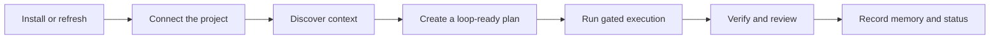
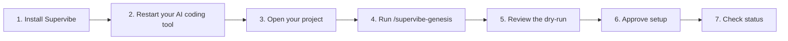
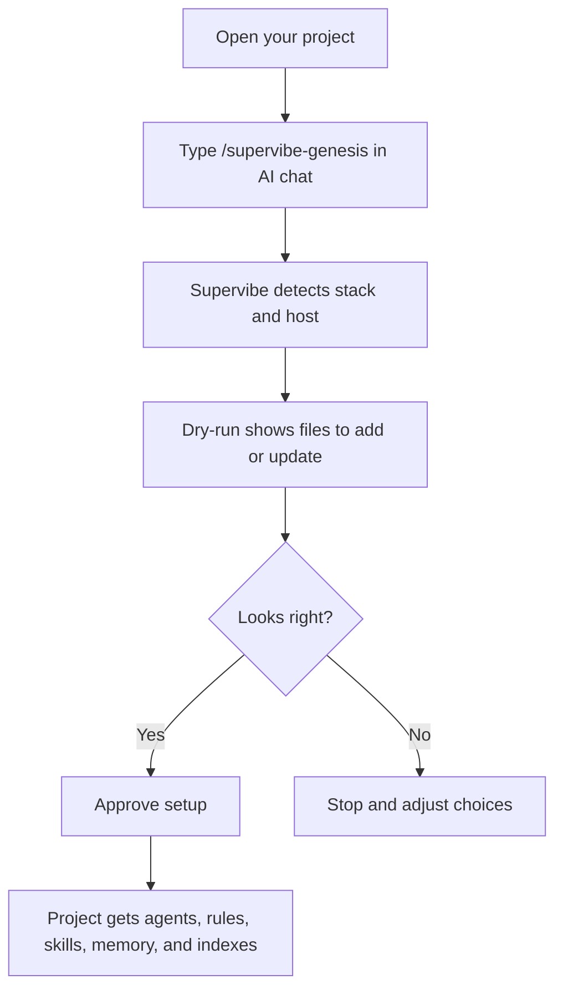
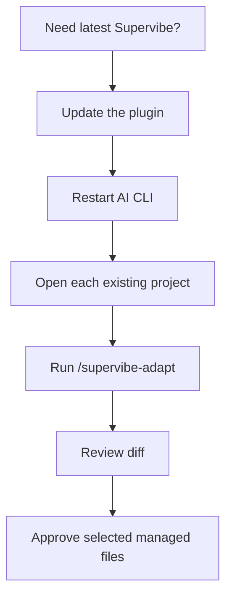

# Supervibe

[English](README.md) | [Русский](README%2Eru.md)

**Supervibe adds project-aware workflows to Claude Code, Codex, Gemini, Cursor, and OpenCode.**
It helps your AI coding tool inspect a project, plan changes, design UI, review work, and keep local project memory.

Runs locally. No Docker. Windows, macOS, and Linux.

Supervibe keeps the normal brainstorm -> loop-ready plan -> user-approved graph path fast. Specialist agents and scoped receipts are required when Supervibe claims delegated agent output, explicit strict review, verification, release evidence, or design/prototype completion; simple routing and next-action handoffs stay lightweight.

**v2.1** - current plugin `v2.1.44` - MIT - 2406 tests

> **Compliance notice:** This tool is designed exclusively for development assistance. By using it, you agree to comply with the Terms of Service (ToS) and Acceptable Use Policy (AUP) of all involved services, including Anthropic. Unauthorized automated usage, OAuth token abuse, or violation of third-party policies is the sole responsibility of the end user.

## Supervibe Lifecycle

Most Supervibe work follows one simple loop:



| Stage | Normal entry point | Evidence Supervibe expects |
|---|---|---|
| Install or refresh | `/supervibe-update`, `/supervibe-adapt` | Installer or adapt dry-run, host registration, managed-block diff |
| Connect the project | `/supervibe-genesis` | Stack detection, selected agents/rules/skills, memory and index setup |
| Discover context | `/supervibe`, `/supervibe-brainstorm <topic>`, `/supervibe-design <brief>` | Project memory, Code RAG, Code Graph readiness, domain evidence when needed |
| Create a loop-ready plan | `/supervibe-plan [<source-artifact>]` | Acceptance criteria, risk map, verification matrix, epics/tasks ready for graph creation |
| Create graph and run | `/supervibe-loop --atomize-plan <plan-path> --user-approved-plan` then `/supervibe-loop --guided --file <graph.json>` | Work item state, scoped write set, targeted verification |
| Verify and review | `/supervibe-status`, `/supervibe-security-audit`, reviewer agents | Validator output, reviewer findings, confidence gate status, residual risks |
| Record memory and status | `/supervibe-status` | Durable memory, context-pack citations, close or resume action |

For the deeper system map, use [workflow quickstart](docs/supervibe-workflow-ux.md) for the everyday MVP flow, [agent roster](docs/agent-roster.md) for specialist boundaries, [workflow hardening](docs/supervibe-workflow-hardening.md) for command and evidence gates, [reference packs](docs/reference-packs.md) for context loading, [confidence gates](docs/confidence-gates-spec.md) for score behavior, and [multi-agent orchestration](docs/multi-agent-orchestration.md) for parallel work.

## Pick Your Starting Point

| I want to... | Start here | First command |
|---|---|---|
| Install Supervibe for the first time | [Install](#install) | Pick Windows or macOS/Linux |
| Set up Supervibe inside a project | [First Project Setup](#first-project-setup) | `/supervibe-genesis` |
| Plan a feature safely | [Common Workflows](#common-workflows) | `/supervibe-brainstorm "idea"` |
| Design a UI or landing page | [Common Workflows](#common-workflows) | `/supervibe-design <brief>` |
| Update Supervibe | [Update Or Refresh](#update-or-refresh) | `/supervibe-update` |
| Refresh an already configured project | [Update Or Refresh](#update-or-refresh) | `/supervibe-adapt` |
| Check health or fix install trouble | [Troubleshooting](#troubleshooting) | Find your symptom |

## Plain-English Map

Use this when you do not know which section to read.

```text
I am on a new computer
  -> Install Supervibe once
  -> restart the AI coding tool
  -> open a project
  -> run /supervibe-genesis
  -> run /supervibe-status

I already installed Supervibe, but this is a new project
  -> open that project
  -> run /supervibe-genesis
  -> read the dry-run
  -> approve only if it looks right

I already use Supervibe and want the latest version
  -> run /supervibe-update, or the update script
  -> restart the AI coding tool
  -> run /supervibe-adapt inside each old project

Something looks broken
  -> run /supervibe-status
  -> if it still looks wrong, run /supervibe-doctor
```

The smallest mental model:

```text
Install tool once
      |
      v
Connect each project with /supervibe-genesis
      |
      v
Use /supervibe to pick the next safe workflow
      |
      v
Check health with /supervibe-status
```

## Quick Start

The beginner path is one loop:



Plain version:

1. Install Supervibe once.
2. Restart Claude Code, Codex, Gemini, Cursor, or OpenCode.
3. Open the project where you want Supervibe to help.
4. Type `/supervibe-genesis` in the AI CLI chat.
5. Read the dry-run before approving.
6. Approve only the files you want Supervibe to manage.
7. Run `/supervibe --status` or `/supervibe-status`.

## Workflow Quickstart

Use this path when Supervibe is already installed and the project is connected:

```text
start -> check graph status -> dispatch ready work -> collect receipts -> recover blockers -> final validation
```

1. Start with `/supervibe` or the command for the work you already know, such as `/supervibe-brainstorm`, `/supervibe-plan`, `/supervibe-design`, or `/supervibe-loop --guided --file <graph.json>`.
2. Check status with `/supervibe-status` or `/supervibe-loop --status --epic <epic-id>` before mutating work. The useful states are `ready`, `blocked`, `claimed`, `stale`, `orphan`, `review`, and `done`.
3. Dispatch ready work through the workflow command instead of copying specialist output into chat. Durable work should show the selected agents or workers and bind their output to current-run receipts.
4. Treat receipts as proof, not decoration. A completion claim should point to scoped receipts, task evidence, and any review or verification output required by the workflow.
5. If the graph is blocked or stale, use status and recovery commands first: resume an interrupted loop, clear stale claims, attach missing evidence, or rerun close eligibility before declaring work complete.
6. Defer full test and validator suites for plan, graph, and task workflows until the final release or merge gate. Run targeted checks only when the workflow explicitly asks for them during development.

See [workflow quickstart](docs/supervibe-workflow-ux.md) for examples and recovery notes.

## Where To Type Commands

This is the rule that prevents most confusion.

| Command type | Where to type it | Example |
|---|---|---|
| Slash commands | In Claude Code, Codex, Gemini, Cursor, or OpenCode chat | `/supervibe-genesis` |
| Terminal commands | In PowerShell, Terminal, bash, or zsh | `npm run supervibe:status` |
| Terminal dispatcher | In a terminal after bin links are installed | `supervibe commands`, `supervibe doctor` |
| Installer commands | In your operating system terminal | `irm ... | iex` |

> **Warning:** Do not type slash commands like `/supervibe-adapt` in PowerShell, bash, or zsh. Slash commands belong in the AI CLI chat.

Command compass:

```text
Starts with /supervibe-...  -> type it in the AI chat
Starts with npm run ...     -> type it in a terminal
Starts with node ...        -> type it in a terminal
Starts with curl or irm     -> type it in your OS terminal
```

`supervibe-stage` and `supervibe-validate` are terminal/bin aliases for runtime tooling. They are not slash commands unless a matching file exists under `commands/`.

## Memory-Safe Node Runs

For large local checks, especially on Windows, use the memory-safe npm aliases:

```powershell
npm run check:memory-safe
npm run test:memory-safe
npm run code:index:memory-safe
```

The generic wrapper works with any command:

```powershell
npm run node:memory-safe -- --max-old-space-size 6144 -- npm run check
```

The wrapper adds only `NODE_OPTIONS` flags supported by the current Node.js
runtime via `process.allowedNodeEnvironmentFlags`. Unsupported flags are
reported and skipped instead of breaking the user's Node version. Defaults are
`--max-old-space-size=4096` and `--heapsnapshot-near-heap-limit=3`.

## Runtime Cleanup

Supervibe daemon commands register their PID under `.supervibe/servers/` and in
`.supervibe/memory/runtime-cleanup-registry.json`. To inspect old local daemons
before stopping anything:

```powershell
npm run supervibe:cleanup:unused:dry-run
```

To stop unused managed daemons older than the default 60 minute threshold:

```powershell
npm run supervibe:cleanup:unused
```

Use the lower-level command to tune the threshold:

```powershell
node scripts/supervibe-runtime-cleanup.mjs --unused --older-than-minutes 15 --dry-run
```

On Windows, cleanup uses a process-tree stop for managed Node daemons so child
processes do not remain behind after the parent exits.

For `.supervibe` artifact lifecycle cleanup, use the reversible GC flow. Dry-run
and review modes classify hot, protected, warm, archivable, cold, trash, and
unclassified files before any apply path:

```powershell
npm run supervibe:gc -- --lifecycle --mode dry-run
npm run supervibe:gc -- --lifecycle --mode review
npm run supervibe:gc -- --artifacts --dry-run --archive-keep-last 5 --archive-retention-days 90
```

Reachability wins over age: active roots, trusted receipts, receipt-linked
outputs, compact manifests, and protected provenance are not cleanup candidates
just because they are old. See [cleanup lifecycle](docs/supervibe-cleanup-lifecycle.md).

## Install

Requirements:

- Node.js 22.5+ with `node:sqlite`
- Git
- Network access for the ONNX embedding model download from HuggingFace

The installer checks Node.js before registration. If Node.js is missing or too old, it asks for explicit consent before installing or upgrading it.

Release integrity evidence lives in [release security](docs/release-security.md), [install integrity](docs/install-integrity.md), [third-party licenses](docs/third-party-licenses.md), and [LICENSE](LICENSE).

Install picture:

```text
Your OS terminal
      |
      v
Run install.sh or install.ps1
      |
      +-- checks Node.js and Git
      +-- installs npm dependencies
      +-- downloads the ONNX model
      +-- registers Claude/Codex/Gemini/etc. when found
      |
      v
Restart the AI coding tool
      |
      v
Open your project and run /supervibe-genesis
```

### macOS / Linux

```bash
curl -fsSL https://raw.githubusercontent.com/vTRKA/supervibe/main/install.sh | bash
```

### Windows PowerShell

```powershell
irm https://raw.githubusercontent.com/vTRKA/supervibe/main/install.ps1 | iex
```

The installer:

1. Downloads or updates the Supervibe plugin checkout.
2. Installs dependencies with `npm ci`.
3. Downloads or reuses the ONNX model.
4. Registers supported local hosts such as Claude Code, Codex, and Gemini when available.
5. Runs the install lifecycle doctor.
6. Prints next steps.

After restart, you should see something like:

```text
[supervibe] welcome  plugin v2.1.44 initialized for this project
[supervibe] code RAG  N files / M chunks (fresh)
[supervibe] code graph  N symbols / M edges (X% resolved)
```

### Other Hosts

| Host | Recommended path |
|---|---|
| Claude Code | Use the one-line installer above |
| Codex CLI | Use the one-line installer above |
| Gemini CLI | Use the one-line installer above, or `gemini extensions install https://github.com/vTRKA/supervibe` |
| Cursor | Use `/add-plugin supervibe` or Cursor's plugin marketplace |
| OpenCode | Add `supervibe@git+https://github.com/vTRKA/supervibe.git` to `opencode.json` |
| GitHub Copilot CLI | Use the Copilot plugin marketplace commands |

Codex note: when Codex is detected, the installer keeps the managed checkout under `~/.codex/plugins/marketplaces/supervibe-marketplace`, registers the plugin cache under `~/.codex/plugins/cache/supervibe-marketplace/supervibe/local`, enables `[plugins."supervibe@supervibe-marketplace"]` in `~/.codex/config.toml`, keeps a legacy `~/.codex/plugins/supervibe` link, and links native skills into `~/.agents/skills/supervibe`.

## First Project Setup

Install is only step one. Each project must also be connected.



Run in the AI CLI chat:

```text
/supervibe-genesis
```

The dry-run should show:

- detected stack
- selected agent groups
- rules and skills
- memory and index files
- host instruction changes

Approve only after the dry-run looks right. Supervibe managed blocks are updated by Supervibe; your own project notes stay yours.

## Common Workflows

| Goal | Use this | What happens |
|---|---|---|
| Ask what to do next | `/supervibe` | Routes to the safest next workflow |
| New feature idea | `/supervibe-brainstorm "idea"` then `/supervibe-plan --loop-ready --from-brainstorm <spec-path>` | Turns a vague idea into a spec and plan |
| UI, landing page, or product screen | `/supervibe-design <brief>` | Creates brand direction, prototype, preview, feedback loop, and handoff |
| Execute an approved plan | `/supervibe-loop --atomize-plan <plan-path> --user-approved-plan` | Creates the graph and starts claimable work without an extra review ritual |
| Long task with visible state | `/supervibe-loop --guided --file <graph.json>` | Runs a visible, cancellable loop from an atomized work graph |
| Verify, review, or ship completed work | `/supervibe-verify`, `/supervibe-review`, then `/supervibe-ship` | Maps evidence to goals, runs production-readiness review, then checks release readiness |
| Security review | `/supervibe-security-audit` | Produces read-only findings first |
| Documentation or command sync | `/supervibe-plan --docs-sync` | Plans a README/docs refresh against the current command catalog and workflow evidence |
| See tasks in a browser | `/supervibe-ui` | Opens a local control plane |
| Audit or strengthen Supervibe itself | `/supervibe-audit`, `/supervibe-score`, `/supervibe-strengthen` | Finds stale artifacts, scores outputs, and repairs weak agents or skills from telemetry |
| Check health | `/supervibe-status` or `/supervibe --status` | Shows memory, RAG, graph, policy, and workflow state |

### Safe Planning Path

The normal path is:

```text
brainstorm -> loop-ready plan -> user-approved graph -> safe execution
```

Text-first summaries are the default for workflow schemes: Supervibe should explain stages with compact tables, stage maps, or improvised ASCII diagrams. Browser previews are reserved for actual UI/prototype/browser verification work, not ordinary planning summaries.

Validator label:

```text
Brainstorm -> Loop-ready plan -> Atomize -> Safe run -> Optional verify/review
```

Workflow summary gates are durable artifacts, not chat-only prose. The summary
flow has explicit `pre-spec`, `post-spec`, `pre-plan`, and `post-plan` stages
under `.supervibe/artifacts/summaries/`, validated at release with
`npm run validate:workflow-summary-artifacts`.

Plans are contract artifacts, not loose task lists. A production-ready plan should carry a Development Contract Map for behavior, architecture, data/schema, API/event, UI state, security/privacy, performance, observability, rollout/rollback, and docs/support, then pass `node scripts/validate-plan-artifacts.mjs --file <plan>`.

Plan review is optional before atomization. The normal path is a user-approved loop-ready plan followed by `/supervibe-loop --atomize-plan <plan-path> --user-approved-plan`. Use `/supervibe-plan --review <plan-path>` only when the user asks for deeper review, the plan touches high-risk areas, or release governance requires it. Maintainers can inspect strict review evidence with `node scripts/validate-plan-review-artifacts.mjs --file <review-artifact>` or `node scripts/validate-plan-review-artifacts.mjs --plan <plan> --require-active-review`.

Copy-paste default path:

```text
/supervibe-brainstorm "idea"
/supervibe-plan --loop-ready --from-brainstorm .supervibe/artifacts/specs/example.md
/supervibe-loop --atomize-plan .supervibe/artifacts/plans/example.md --user-approved-plan
/supervibe-loop --guided --file .supervibe/memory/work-items/example-epic/graph.json
```

Default flow: brainstorm -> loop-ready plan -> user-approved graph -> safe execution.

After the graph work is complete, choose the next action explicitly: inspect status, run verification/review, prepare release evidence, archive, resume, or stop. These are not prerequisites for starting normal development. Optional controls are `/supervibe-loop --status --epic example-epic`, `/supervibe-loop --resume .supervibe/memory/loops/example-run/state.json`, `/supervibe-loop --stop example-run`, and `/supervibe-loop --epic example-epic --worktree` when isolated or parallel work is worth the overhead.

For command routing diagnostics, use `/supervibe --diagnose-trigger` when a phrase did not route as expected and `/supervibe --why-trigger` when you want to see the selected command, selected skill, confidence, missing artifacts, and safety blockers. Long-running work stays visible through stop/resume/status controls.

The guided loop runs in the current session. Worktree is optional: add `--worktree` only when you want isolated or parallel sessions. Fresh-context or autonomous modes require provider-safe adapter support and explicit permission handling; when that is missing, Supervibe stays in guided or manual mode.

Repair path:

- Invalid plan repair: revise the loop-ready plan, rerun atomization with `--preview`, and write only after user approval.
- Graph drift repair: inspect `/supervibe-status --ready --blocked --stale --orphan`, then fix dependencies, claims, or ownership before execution.
- Completion blocker repair: run `/supervibe-loop --validate-completion`, attach missing evidence, then rerun `/supervibe-loop --close-eligible`.

Also supported:

```text
/supervibe-plan --loop-ready --from-brainstorm <spec-path>
/supervibe-loop --tracker-sync-push --file .supervibe/memory/work-items/example-epic/graph.json
```

Loop state and evidence live under:

- `.supervibe/memory/loops/`
- `.supervibe/memory/work-items/`
- `.supervibe/memory/bundles/`
- `task-tracker-map.json`

Work items use the same status words everywhere: `ready`, `blocked`, `claimed`, `stale`, `orphan`, `drift`, `review`, and `done`.

## Safety Model

Supervibe is built to show work before it changes project files.

| Safety idea | What it means |
|---|---|
| Dry-runs first | Genesis, adapt, cleanup, and many workflows preview changes |
| User approval | You choose when managed files are written |
| Confidence gates | Agents must show verification before claiming completion |
| Local memory | Project decisions are stored under `.supervibe/memory/` |
| Agent dispatch and receipt proof | Durable command work uses real specialist agents and runtime receipts |
| Provider boundaries | Provider prompts, rate limits, network/MCP approvals, secrets, billing, production mutations, and credential changes are never bypassed |

Autonomous execution is opt-in by invoking the loop and is not the default for ordinary status, planning, or audit summaries. Once invoked, bare `/supervibe-loop` uses the provider-recommended real execution mode; pass `--dry-run` when you explicitly want preview artifacts without mutation.

Unreleased capability label: durable autonomous loop features are implemented in this workspace and remain opt-in until the release gate publishes them.

For command-owned workflow work, inspect the selected agents before mutating:

```bash
node scripts/command-agent-plan.mjs --command /supervibe-plan --host codex --strict
```

`CALLABLE_AGENTS_READY`, `SCOPED_RECEIPT_GATE`, and `HOST_DISPATCH` tell you
whether the current host can run the required specialists. Command or skill
receipts are diagnostic only; they do not replace required agent, worker, or
reviewer receipts for durable outputs.

## Context Intelligence And Index Health

Supervibe separates project memory, Code RAG, Code Graph, host context,
citations, freshness, confidence, and token budget instead of mixing them into
one opaque prompt. Useful inspection commands:

```bash
npm run supervibe:status
npm run code:search -- --query "..."
node scripts/supervibe-context-pack.mjs --query "..." --json
node scripts/build-code-index.mjs --root . --resume --graph --max-files 200 --health --no-embeddings
```

Reference details live in [reference packs](docs/reference-packs.md),
[context intelligence contract](docs/references/context-intelligence-contract.md),
and [RAG, memory, and CodeGraph evals](docs/references/rag-memory-codegraph-evals.md).

## Update Or Refresh

There are two different updates. This distinction matters.



Same flow as ASCII:

```text
Update the plugin
  /supervibe-update
  or update.sh / update.ps1
        |
        v
Restart the AI coding tool
        |
        v
For every project that already used Supervibe:
  open project
  run /supervibe-adapt
  read the diff
  approve only the managed files you want
```

### 1. Update the plugin itself

In AI CLI chat:

```text
/supervibe-update
```

Or from your operating system terminal:

macOS / Linux:

```bash
curl -fsSL https://raw.githubusercontent.com/vTRKA/supervibe/main/update.sh | bash
```

Windows PowerShell:

```powershell
irm https://raw.githubusercontent.com/vTRKA/supervibe/main/update.ps1 | iex
```

Manual plugin checkout path:

```bash
npm run supervibe:upgrade
```

### 2. Refresh each project after the plugin update

Open each project that already ran `/supervibe-genesis`, then type in AI CLI chat:

```text
/supervibe-adapt
```

`/supervibe-adapt` reviews managed agents, rules, skills, host instruction blocks, and `.supervibe/memory/.supervibe-version`. It shows a dry-run first and preserves user-owned sections.

> **Warning:** Do not delete installed project agents, rules, or skills to refresh them. Use `/supervibe-adapt`.

## What Supervibe Includes

Most users only need these five ideas:

| Capability | Plain meaning |
|---|---|
| Specialist agents | Different roles for planning, design, debugging, review, and safety |
| Project memory | Reuses decisions instead of asking again |
| Code search and code graph | Finds related files and callers before changes |
| Confidence gates | Requires evidence before claiming work is done |
| Reference packs | Loads only the docs, memory, RAG, graph, and templates needed for the active branch |
| Local workflows | Runs project setup, design, review, preview, and status checks locally |

<details>
<summary>Advanced feature list</summary>

| Feature | What it means |
|---|---|
| 96 specialist agents | Role-specific agents for repositories, architecture, design, security, QA, operations, and stacks |
| Code graph | Tree-sitter symbols and edges; query callers, callees, neighbors, and impact |
| Semantic code search | Offline multilingual source search with local embeddings |
| Project memory | Decisions, patterns, incidents, learnings, and solutions under `.supervibe/memory/` |
| 31 project rules | Safety, scope, git, terminal I/O, design governance, refactor discipline, and anti-hallucination rules |
| Visible context intelligence | Context packs show memory, RAG, codegraph, repo-map citations, confidence delta, omitted context, repair actions, and no-silent-done lifecycle evidence |
| Command router and receipts | Natural language command matching, required-agent planning, scoped runtime receipts, and receipt recovery diagnostics |
| Cleanup lifecycle | Reachability-aware `.supervibe` artifact classification before archive or delete decisions |
| Performance SLOs | Local release gates report context-pack latency, token ceilings, watcher overhead, index size, eval runtime, and resource drift |
| Feedback learning loop | User corrections become reviewed memory candidates, eval cases, and regression fixtures |
| Live preview server | Local `localhost:PORT` preview with reload and feedback support |
| Design pipeline | Web, Chrome extension, Electron, Tauri, and mobile-native targets with approved direction, tokens, styleboard, prototype, review, and handoff gates |
| Component library bridges | shadcn, MUI, Mantine, Radix, and HeadlessUI token bridges |
| Multi-CLI install | One installer covers the common local host setup |

</details>

Supported stacks include Laravel, Next.js, Nuxt, Vue, Svelte, React, Express, Fastify, NestJS, FastAPI, Django, Rails, Spring, ASP.NET, Go, Flutter, iOS, Android, Chrome MV3, GraphQL, PostgreSQL, MySQL, MongoDB, Elasticsearch, and Redis.

Agent roster: [docs/agent-roster.md](docs/agent-roster.md)

## Commands

### Slash Commands

Run these in the AI CLI chat.

| Command | What it does |
|---|---|
| `/supervibe` | Auto-router for the next safe action |
| `/supervibe-genesis` | First-time project setup |
| `/supervibe-doctor` | Read-only multi-host installation and registration diagnostics |
| `/supervibe-status` | Project health, indexes, memory, workflow state, delegated inbox, and tracker visibility |
| `/supervibe-audit` | Read-only audit for agents, rules, memory, indexes, routing, and stale artifacts |
| `/supervibe-brainstorm <topic>` | Turn an idea into an approved spec |
| `/supervibe-plan [<spec-path>]` | Turn a spec into a loop-ready implementation plan; optional review stays explicit |
| `/supervibe-execute-plan [<plan-path>]` | Execute a plan with gates |
| `/supervibe-loop --request/--file/--epic` | Visible goal-until-complete loop over native work graphs with status, resume, stop, and completion gates |
| `/supervibe-verify` | Tester-style verification against explicit goals and evidence |
| `/supervibe-review` | Production-readiness review after verification |
| `/supervibe-ship` | Release-readiness gate covering deployment, rollback, support, and target constraints |
| `/supervibe-design <brief>` | Design pipeline from direction to prototype and handoff |
| `/supervibe-security-audit` | Read-only security audit first |
| `/supervibe-ui` | Local browser control plane |
| `/supervibe-preview` | Manage preview servers |
| `/supervibe-gc` | Reversible cleanup preview/apply flow for stale Supervibe artifacts |
| `/supervibe-score` | Score an artifact against its confidence rubric and list gaps |
| `/supervibe-strengthen` | Improve underperforming agents or skills from telemetry |
| `/supervibe-update` | Update the plugin |
| `/supervibe-adapt` | Refresh managed project files after plugin update |

### Useful Terminal Commands

Run these in a terminal, usually from the plugin checkout.

| Command | What it does |
|---|---|
| `npm run supervibe:status` | Health check across indexes and workflow state |
| `npm run supervibe:commands` | Deterministic catalog of shortcuts, slash commands, npm scripts, and command matching |
| `npm run supervibe:agent-plan -- --command /supervibe-plan --strict` | Show required agents, host dispatch readiness, and receipt gate for a command |
| `npm run supervibe:doctor -- --host all` | Host registration diagnostics |
| `npm run supervibe:install-doctor` | Post-install lifecycle audit |
| `npm run supervibe:upgrade` | Manual plugin checkout upgrade |
| `npm run supervibe:upgrade-check` | Check upstream for new commits |
| `npm run supervibe:ui -- --file <graph.json>` | Open the local control plane from a graph file |
| `npm run supervibe:preview -- --list` | List preview servers |
| `npm run supervibe:gc -- --lifecycle --mode dry-run` | Classify `.supervibe` artifacts before cleanup |
| `npm run supervibe:memory-health` | Inspect project memory quality and lifecycle |
| `npm run supervibe:agent-heatmap` | Inspect empirical agent capability and weak spots |
| `npm run supervibe:runtime-doctor` | Runtime cleanup and daemon safety diagnostics |
| `npm run supervibe:docs-audit` | User-facing docs relevance audit |
| `npm run code:search -- --query "..."` | Manual semantic search |
| `npm run workflow:receipt -- inspect` | Inspect workflow receipt trust and drift |
| `npm run check` | Full maintainer validation suite |

Release-only or maintainer gates include `npm run validate:workflow-summary-artifacts`,
`npm run validate:supervibe-cleanup-lifecycle`,
`npm run validate:command-agent-enforcement`,
`npm run validate:workflow-receipts`,
`npm run supervibe:runtime-10of10-targeted`, and
`npm run supervibe:runtime-10of10-proof`. For plan, graph, and task workflows,
defer tests and validators until the final release or merge gate.

## Troubleshooting

| Symptom | What to do |
|---|---|
| No banner after install | Re-run the installer, fully restart the AI CLI, then check `.supervibe/audits/install-lifecycle/latest.json` |
| Slash command typed in terminal | Move it to the AI CLI chat; terminal shells do not understand `/supervibe-*` |
| Zed with Codex ACP does not show Supervibe after `/` | Re-run installer, restart the Zed external-agent session, then run `npm run supervibe:doctor -- --host codex --strict` |
| `Protobuf parsing failed` | Re-run the installer; the ONNX model is missing, incomplete, or corrupt |
| Model download takes a long time | Let it continue; the installer has no total or stall timeout for the HuggingFace ONNX download |
| Windows install starts in WSL | Use PowerShell `install.ps1` for Windows, or set `SUPERVIBE_ALLOW_WSL_INSTALL=1` only for intentional WSL install |
| SQLite errors | Install Node.js 22.5+ or re-run installer and approve the Node upgrade prompt |
| PowerShell execution policy blocks install | Run `Set-ExecutionPolicy -Scope Process Bypass`, then retry |
| Stale or partial code index | Runtime hooks and `search-code.mjs` self-heal normal drift; if status still reports a blocker, run the repair command printed by `/supervibe-status` or `npm run supervibe:status` from the controller/maintenance lane |

Manual index repair from a user project (maintenance fallback, not an agent workflow step):

```bash
node <resolved-supervibe-plugin-root>/scripts/build-code-index.mjs --root . --list-missing
node <resolved-supervibe-plugin-root>/scripts/build-code-index.mjs --root . --resume --source-only --max-files 200 --max-seconds 120 --health --json-progress
node <resolved-supervibe-plugin-root>/scripts/build-code-index.mjs --root . --resume --graph --max-files 200 --health
```

Use `--force --health` only for a deliberate full rebuild.

Receipt diagnostics from the plugin checkout:

```bash
node scripts/workflow-receipt.mjs inspect
node scripts/workflow-receipt.mjs recovery-status
node scripts/workflow-receipt.mjs reissue --receipt <receipt-json>
node scripts/workflow-receipt.mjs prune-stale --apply
node scripts/workflow-receipt.mjs rebuild-ledger --prune-stale
npm run validate:workflow-receipts
```

## Uninstall

Plugin removal and project data removal are different.

### Remove the plugin

macOS / Linux:

```bash
rm -rf ~/.codex/plugins/marketplaces/supervibe-marketplace
rm -rf ~/.claude/plugins/marketplaces/supervibe-marketplace
rm -rf ~/.codex/plugins/cache/supervibe-marketplace/supervibe
rm -f  ~/.codex/plugins/supervibe
rm -rf ~/.agents/skills/supervibe
```

Also remove `[plugins."supervibe@supervibe-marketplace"]` from `~/.codex/config.toml` if present.

### Remove Supervibe from one project

Only do this if you no longer want Supervibe state in that project:

```bash
rm -rf .supervibe
```

Keep `.supervibe/` if you want project memory, plans, loop state, or audit evidence.
