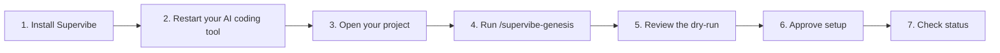
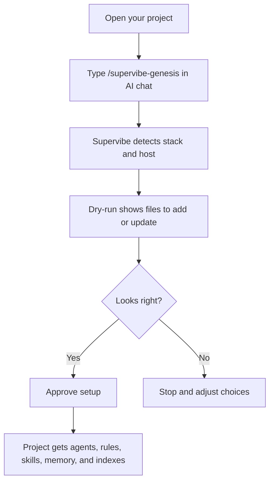
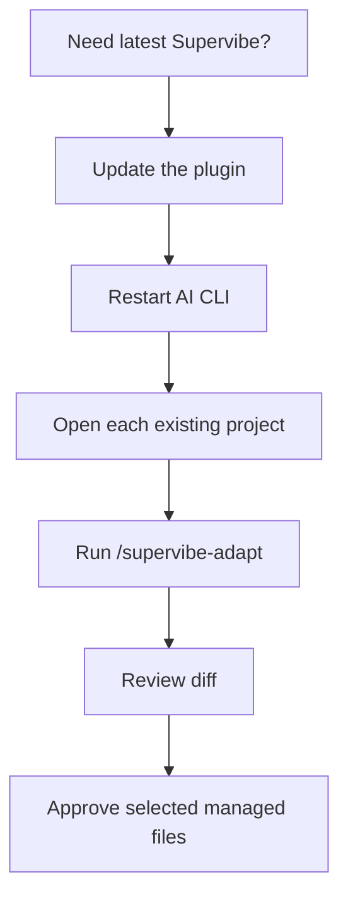

# Supervibe

[English](README.md) | [Русский](README%2Eru.md)

**Supervibe adds project-aware workflows to Claude Code, Codex, Gemini, Cursor, and OpenCode.**
It helps your AI coding tool inspect a project, plan changes, design UI, review work, and keep local project memory.

Runs locally. No Docker. Windows, macOS, and Linux.

**v2.0** - current plugin `v2.0.123` - MIT - 1457 tests

> **Compliance notice:** This tool is designed exclusively for development assistance. By using it, you agree to comply with the Terms of Service (ToS) and Acceptable Use Policy (AUP) of all involved services, including Anthropic. Unauthorized automated usage, OAuth token abuse, or violation of third-party policies is the sole responsibility of the end user.

## Pick Your Starting Point

| I want to... | Start here | First command |
|---|---|---|
| Install Supervibe for the first time | [Install](#install) | Pick Windows or macOS/Linux |
| Set up Supervibe inside a project | [First Project Setup](#first-project-setup) | `/supervibe-genesis` |
| Plan a feature safely | [Common Workflows](#common-workflows) | `/supervibe-brainstorm "idea"` |
| Design a UI or landing page | [Common Workflows](#common-workflows) | `/supervibe-design <brief>` |
| Update Supervibe | [Update Or Refresh](#update-or-refresh) | `/supervibe-update` |
| Refresh an already configured project | [Update Or Refresh](#update-or-refresh) | `/supervibe-adapt` |
| Check health or fix install trouble | [Troubleshooting](#troubleshooting) | Find your symptom |

## Quick Start

The beginner path is one loop:



Plain version:

1. Install Supervibe once.
2. Restart Claude Code, Codex, Gemini, Cursor, or OpenCode.
3. Open the project where you want Supervibe to help.
4. Type `/supervibe-genesis` in the AI CLI chat.
5. Read the dry-run before approving.
6. Approve only the files you want Supervibe to manage.
7. Run `/supervibe --status` or `/supervibe-status`.

## Where To Type Commands

This is the rule that prevents most confusion.

| Command type | Where to type it | Example |
|---|---|---|
| Slash commands | In Claude Code, Codex, Gemini, Cursor, or OpenCode chat | `/supervibe-genesis` |
| Terminal commands | In PowerShell, Terminal, bash, or zsh | `npm run supervibe:status` |
| Installer commands | In your operating system terminal | `irm ... | iex` |

> **Warning:** Do not type slash commands like `/supervibe-adapt` in PowerShell, bash, or zsh. Slash commands belong in the AI CLI chat.

## Install

Requirements:

- Node.js 22.5+ with `node:sqlite`
- Git
- Network access for the ONNX embedding model download from HuggingFace

The installer checks Node.js before registration. If Node.js is missing or too old, it asks for explicit consent before installing or upgrading it.

Release integrity evidence lives in [release security](docs/release-security.md), [install integrity](docs/install-integrity.md), [third-party licenses](docs/third-party-licenses.md), and [LICENSE](LICENSE).

### macOS / Linux

```bash
curl -fsSL https://raw.githubusercontent.com/vTRKA/supervibe/main/install.sh | bash
```

### Windows PowerShell

```powershell
irm https://raw.githubusercontent.com/vTRKA/supervibe/main/install.ps1 | iex
```

The installer:

1. Downloads or updates the Supervibe plugin checkout.
2. Installs dependencies with `npm ci`.
3. Downloads or reuses the ONNX model.
4. Registers supported local hosts such as Claude Code, Codex, and Gemini when available.
5. Runs the install lifecycle doctor.
6. Prints next steps.

After restart, you should see something like:

```text
[supervibe] welcome  plugin v2.0.123 initialized for this project
[supervibe] code RAG  N files / M chunks (fresh)
[supervibe] code graph  N symbols / M edges (X% resolved)
```

### Other Hosts

| Host | Recommended path |
|---|---|
| Claude Code | Use the one-line installer above |
| Codex CLI | Use the one-line installer above |
| Gemini CLI | Use the one-line installer above, or `gemini extensions install https://github.com/vTRKA/supervibe` |
| Cursor | Use `/add-plugin supervibe` or Cursor's plugin marketplace |
| OpenCode | Add `supervibe@git+https://github.com/vTRKA/supervibe.git` to `opencode.json` |
| GitHub Copilot CLI | Use the Copilot plugin marketplace commands |

Codex note: the installer registers the plugin cache under `~/.codex/plugins/cache/supervibe-marketplace/supervibe/local`, enables `[plugins."supervibe@supervibe-marketplace"]` in `~/.codex/config.toml`, keeps a legacy `~/.codex/plugins/supervibe` link, and links native skills into `~/.agents/skills/supervibe`.

## First Project Setup

Install is only step one. Each project must also be connected.



Run in the AI CLI chat:

```text
/supervibe-genesis
```

The dry-run should show:

- detected stack
- selected agent groups
- rules and skills
- memory and index files
- host instruction changes

Approve only after the dry-run looks right. Supervibe managed blocks are updated by Supervibe; your own project notes stay yours.

## Common Workflows

| Goal | Use this | What happens |
|---|---|---|
| Ask what to do next | `/supervibe` | Routes to the safest next workflow |
| New feature idea | `/supervibe-brainstorm "idea"` then `/supervibe-plan --from-brainstorm <spec-path>` | Turns a vague idea into a spec and plan |
| UI, landing page, or product screen | `/supervibe-design <brief>` | Creates brand direction, prototype, preview, feedback loop, and handoff |
| Execute an approved plan | `/supervibe-execute-plan <plan-path>` | Runs plan steps with verification gates |
| Long task with visible state | `/supervibe-loop --guided` | Runs a visible, cancellable loop |
| Security review | `/supervibe-security-audit` | Produces read-only findings first |
| See tasks in a browser | `/supervibe-ui` | Opens a local control plane |
| Check health | `/supervibe-status` or `/supervibe --status` | Shows memory, RAG, graph, policy, and workflow state |

### Safe Planning Path

The normal path is:

```text
brainstorm -> reviewed plan -> atomized epic -> safe execution
```

Validator label:

```text
Brainstorm -> Plan -> Review -> Atomize -> Safe Run
```

Copy-paste example:

```text
/supervibe-brainstorm "idea"
/supervibe-plan --from-brainstorm .supervibe/artifacts/specs/example.md
/supervibe-plan --review .supervibe/artifacts/plans/example.md
/supervibe-loop --atomize-plan .supervibe/artifacts/plans/example.md --plan-review-passed
/supervibe-loop --guided
/supervibe-loop --epic example-epic --worktree
/supervibe-loop --status --epic example-epic
/supervibe-loop --resume .supervibe/memory/loops/example-run/state.json
/supervibe-loop --stop example-run
```

For command routing diagnostics, use `/supervibe --diagnose-trigger` when a phrase did not route as expected and `/supervibe --why-trigger` when you want to see the selected command, selected skill, confidence, missing artifacts, and safety blockers. Long-running work stays visible through stop/resume/status controls.

The guided loop runs in the current session. Worktree is optional: add `--worktree` only when you want isolated or parallel sessions. Fresh-context or autonomous modes require provider-safe adapter support and explicit permission handling; when that is missing, Supervibe stays in guided or manual mode.

Also supported:

```text
/supervibe-plan --from-brainstorm <spec-path>
/supervibe-loop --tracker-sync-push --file .supervibe/memory/work-items/example-epic/graph.json
```

Loop state and evidence live under:

- `.supervibe/memory/loops/`
- `.supervibe/memory/work-items/`
- `.supervibe/memory/bundles/`
- `task-tracker-map.json`

Work items use the same status words everywhere: `ready`, `blocked`, `claimed`, `stale`, `orphan`, `drift`, `review`, and `done`.

## Safety Model

Supervibe is built to show work before it changes project files.

| Safety idea | What it means |
|---|---|
| Dry-runs first | Genesis, adapt, cleanup, and many workflows preview changes |
| User approval | You choose when managed files are written |
| Confidence gates | Agents must show verification before claiming completion |
| Local memory | Project decisions are stored under `.supervibe/memory/` |
| Provider boundaries | Provider prompts, rate limits, network/MCP approvals, secrets, billing, production mutations, and credential changes are never bypassed |

Autonomous execution is opt-in, not the default. The default path is planning, review, status, diagnostics, and dry-run artifacts.

Unreleased capability label: durable autonomous loop features are implemented in this workspace and remain opt-in until the release gate publishes them.

## Update Or Refresh

There are two different updates. This distinction matters.



### 1. Update the plugin itself

In AI CLI chat:

```text
/supervibe-update
```

Or from your operating system terminal:

macOS / Linux:

```bash
curl -fsSL https://raw.githubusercontent.com/vTRKA/supervibe/main/update.sh | bash
```

Windows PowerShell:

```powershell
irm https://raw.githubusercontent.com/vTRKA/supervibe/main/update.ps1 | iex
```

Manual plugin checkout path:

```bash
npm run supervibe:upgrade
```

### 2. Refresh each project after the plugin update

Open each project that already ran `/supervibe-genesis`, then type in AI CLI chat:

```text
/supervibe-adapt
```

`/supervibe-adapt` reviews managed agents, rules, skills, host instruction blocks, and `.supervibe/memory/.supervibe-version`. It shows a dry-run first and preserves user-owned sections.

> **Warning:** Do not delete installed project agents, rules, or skills to refresh them. Use `/supervibe-adapt`.

## What Supervibe Includes

Most users only need these five ideas:

| Capability | Plain meaning |
|---|---|
| Specialist agents | Different roles for planning, design, debugging, review, and safety |
| Project memory | Reuses decisions instead of asking again |
| Code search and code graph | Finds related files and callers before changes |
| Confidence gates | Requires evidence before claiming work is done |
| Local workflows | Runs project setup, design, review, preview, and status checks locally |

<details>
<summary>Advanced feature list</summary>

| Feature | What it means |
|---|---|
| 92 specialist agents | Role-specific agents for repositories, architecture, design, security, QA, operations, and stacks |
| Code graph | Tree-sitter symbols and edges; query callers, callees, neighbors, and impact |
| Semantic code search | Offline multilingual source search with local embeddings |
| Project memory | Decisions, patterns, incidents, learnings, and solutions under `.supervibe/memory/` |
| 31 project rules | Safety, scope, git, terminal I/O, design governance, refactor discipline, and anti-hallucination rules |
| Visible context intelligence | Context packs show memory, RAG, codegraph, repo-map citations, confidence delta, omitted context, repair actions, and no-silent-done lifecycle evidence |
| Performance SLOs | Local release gates report context-pack latency, token ceilings, watcher overhead, index size, eval runtime, and resource drift |
| Feedback learning loop | User corrections become reviewed memory candidates, eval cases, and regression fixtures |
| Live preview server | Local `localhost:PORT` preview with reload and feedback support |
| Design pipeline | Web, Chrome extension, Electron, Tauri, and mobile-native design targets |
| Component library bridges | shadcn, MUI, Mantine, Radix, and HeadlessUI token bridges |
| Multi-CLI install | One installer covers the common local host setup |

</details>

Supported stacks include Laravel, Next.js, Nuxt, Vue, Svelte, React, Express, Fastify, NestJS, FastAPI, Django, Rails, Spring, ASP.NET, Go, Flutter, iOS, Android, Chrome MV3, GraphQL, PostgreSQL, MySQL, MongoDB, Elasticsearch, and Redis.

Agent roster: [docs/agent-roster.md](docs/agent-roster.md)

## Commands

### Daily Slash Commands

Run these in the AI CLI chat.

| Command | What it does |
|---|---|
| `/supervibe` | Auto-router for the next safe action |
| `/supervibe-genesis` | First-time project setup |
| `/supervibe-brainstorm <topic>` | Turn an idea into an approved spec |
| `/supervibe-plan [<spec-path>]` | Turn a spec into an implementation plan |
| `/supervibe-execute-plan [<plan-path>]` | Execute a plan with gates |
| `/supervibe-loop --request/--plan/--from-prd` | Visible goal-until-complete loop with status, resume, and stop |
| `/supervibe-design <brief>` | Design pipeline from direction to prototype and handoff |
| `/supervibe-security-audit` | Read-only security audit first |
| `/supervibe-ui` | Local browser control plane |
| `/supervibe-preview` | Manage preview servers |
| `/supervibe-update` | Update the plugin |
| `/supervibe-adapt` | Refresh managed project files after plugin update |

### Useful Terminal Commands

Run these in a terminal, usually from the plugin checkout.

| Command | What it does |
|---|---|
| `npm run supervibe:status` | Health check across indexes and workflow state |
| `npm run supervibe:doctor -- --host all` | Host registration diagnostics |
| `npm run supervibe:install-doctor` | Post-install lifecycle audit |
| `npm run supervibe:upgrade` | Manual plugin checkout upgrade |
| `npm run supervibe:upgrade-check` | Check upstream for new commits |
| `npm run supervibe:ui -- --file <graph.json>` | Open the local control plane from a graph file |
| `npm run supervibe:preview -- --list` | List preview servers |
| `npm run supervibe:docs-audit` | User-facing docs relevance audit |
| `npm run code:search -- --query "..."` | Manual semantic search |
| `npm run check` | Full maintainer validation suite |

## Troubleshooting

| Symptom | What to do |
|---|---|
| No banner after install | Re-run the installer, fully restart the AI CLI, then check `.supervibe/audits/install-lifecycle/latest.json` |
| Slash command typed in terminal | Move it to the AI CLI chat; terminal shells do not understand `/supervibe-*` |
| Zed with Codex ACP does not show Supervibe after `/` | Re-run installer, restart the Zed external-agent session, then run `npm run supervibe:doctor -- --host codex --strict` |
| `Protobuf parsing failed` | Re-run the installer; the ONNX model is missing, incomplete, or corrupt |
| Model download takes a long time | Let it continue; the installer has no total or stall timeout for the HuggingFace ONNX download |
| Windows install starts in WSL | Use PowerShell `install.ps1` for Windows, or set `SUPERVIBE_ALLOW_WSL_INSTALL=1` only for intentional WSL install |
| SQLite errors | Install Node.js 22.5+ or re-run installer and approve the Node upgrade prompt |
| PowerShell execution policy blocks install | Run `Set-ExecutionPolicy -Scope Process Bypass`, then retry |
| Stale or partial code index | Run the repair command printed by `/supervibe-status` or `npm run supervibe:status` |

Index repair from a user project:

```bash
node <resolved-supervibe-plugin-root>/scripts/build-code-index.mjs --root . --list-missing
node <resolved-supervibe-plugin-root>/scripts/build-code-index.mjs --root . --resume --source-only --max-files 200 --max-seconds 120 --health --json-progress
node <resolved-supervibe-plugin-root>/scripts/build-code-index.mjs --root . --resume --graph --max-files 200 --health
```

Use `--force --health` only for a deliberate full rebuild.

## Uninstall

Plugin removal and project data removal are different.

### Remove the plugin

macOS / Linux:

```bash
rm -rf ~/.claude/plugins/marketplaces/supervibe-marketplace
rm -rf ~/.codex/plugins/cache/supervibe-marketplace/supervibe
rm -f  ~/.codex/plugins/supervibe
rm -rf ~/.agents/skills/supervibe
```

Also remove `[plugins."supervibe@supervibe-marketplace"]` from `~/.codex/config.toml` if present.

### Remove Supervibe from one project

Only do this if you no longer want Supervibe state in that project:

```bash
rm -rf .supervibe
```

Keep `.supervibe/` if you want project memory, plans, loop state, or audit evidence.
