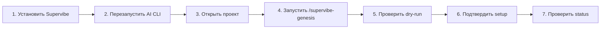
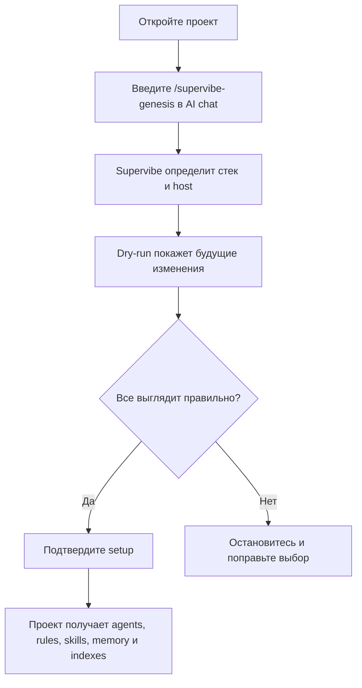

# Supervibe

[English](README.md) | [Русский](README.ru.md)

Supervibe превращает Claude Code, Codex, Gemini, Cursor и OpenCode в локальную команду AI-агентов для разработки. Он помогает AI-инструменту читать проект, строить карту кода, помнить решения, планировать изменения, проверять результат и помогать с дизайном.

Работает локально. Docker не нужен. Windows, macOS и Linux.

Supervibe ускоряет путь brainstorm -> loop-ready plan -> user-approved graph. Агентские scoped receipts нужны только для делегированной работы, строгого review, verification, release evidence и design/prototype; обычные handoff остаются легкими.

**v2.1** - текущий плагин `v2.1.41` - MIT - 2316 тестов

> **Уведомление о соблюдении правил:** Supervibe предназначен только для помощи в разработке. Используя его, вы отвечаете за соблюдение Terms of Service (ToS) и Acceptable Use Policy (AUP) всех сервисов, включая Anthropic. Неразрешенная автоматизация, злоупотребление OAuth-токенами или нарушение правил сторонних сервисов остаются ответственностью пользователя.

## С чего начать

| Что нужно сделать | Куда идти | Первая команда |
|---|---|---|
| Установить Supervibe впервые | [Установка](#установка) | Выберите Windows или macOS/Linux |
| Подключить Supervibe к проекту | [Первый запуск в проекте](#первый-запуск-в-проекте) | `/supervibe-genesis` |
| Спланировать фичу | [Основные сценарии](#основные-сценарии) | `/supervibe-brainstorm "idea"` |
| Сделать UI или landing page | [Основные сценарии](#основные-сценарии) | `/supervibe-design <brief>` |
| Обновить сам плагин | [Обновление](#обновление) | `/supervibe-update` |
| Обновить уже настроенный проект | [Обновление](#обновление) | `/supervibe-adapt` |
| Проверить здоровье или починить установку | [Частые ошибки](#частые-ошибки) | Найдите свой симптом |

## Простая карта

Если непонятно, куда идти, смотрите сюда.

```text
Новый компьютер
  -> один раз установите Supervibe
  -> перезапустите AI-инструмент
  -> откройте проект
  -> введите /supervibe-genesis
  -> проверьте /supervibe-status

Supervibe уже установлен, но проект новый
  -> откройте этот проект
  -> введите /supervibe-genesis
  -> прочитайте dry-run
  -> подтверждайте только если все понятно

Supervibe уже есть, нужна свежая версия
  -> запустите /supervibe-update или update script
  -> перезапустите AI-инструмент
  -> в каждом старом проекте запустите /supervibe-adapt

Что-то сломалось или непонятно
  -> запустите /supervibe-status
  -> если все еще непонятно, запустите /supervibe-doctor
```

Самая короткая схема:

```text
Один раз установить инструмент
      |
      v
Подключить каждый проект через /supervibe-genesis
      |
      v
Использовать /supervibe для выбора следующего шага
      |
      v
Проверять здоровье через /supervibe-status
```

## Быстрый старт

Весь путь для новичка:



Простыми словами:

1. Один раз установите Supervibe.
2. Перезапустите Claude Code, Codex, Gemini, Cursor или OpenCode.
3. Откройте нужный проект.
4. Введите `/supervibe-genesis` в чат AI CLI.
5. Прочитайте dry-run перед подтверждением.
6. Подтвердите только те файлы, которые хотите отдать под управление Supervibe.
7. Проверьте состояние через `/supervibe --status` или `/supervibe-status`.

## Главное правило: где вводить команды

Это самое важное место, потому что здесь чаще всего путаются.

| Тип команды | Где вводить | Пример |
|---|---|---|
| Slash-команды | В чате Claude Code, Codex, Gemini, Cursor или OpenCode | `/supervibe-genesis` |
| Команды терминала | В PowerShell, Terminal, bash или zsh | `npm run supervibe:status` |
| Terminal dispatcher | В терминале после установки bin links | `supervibe commands`, `supervibe doctor` |
| Команды установки | В терминале вашей ОС | `irm ... | iex` |

Компас команд:

```text
Начинается с /supervibe-...  -> вводите в AI chat
Начинается с npm run ...     -> вводите в terminal
Начинается с node ...        -> вводите в terminal
Начинается с curl или irm    -> вводите в terminal вашей ОС
```

`supervibe-stage` и `supervibe-validate` - терминальные/bin-алиасы для runtime-инструментов. Это не slash-команды, пока под них нет файла в `commands/`.

## Memory-safe запуск Node

Для крупных локальных проверок, особенно на Windows, используйте npm-алиасы с
ограничением памяти:

```powershell
npm run check:memory-safe
npm run test:memory-safe
npm run code:index:memory-safe
```

Общая обертка работает с любой командой:

```powershell
npm run node:memory-safe -- --max-old-space-size 6144 -- npm run check
```

Обертка добавляет только те `NODE_OPTIONS`, которые поддерживает текущий
текущая версия Node.js через `process.allowedNodeEnvironmentFlags`. Неподдерживаемые
флаги печатаются как skipped и не ломают запуск на версии Node.js пользователя.
По умолчанию используются `--max-old-space-size=4096` и
`--heapsnapshot-near-heap-limit=3`.

## Очистка runtime-процессов

Daemon-команды Supervibe регистрируют PID в `.supervibe/servers/` и в
`.supervibe/memory/runtime-cleanup-registry.json`. Чтобы сначала посмотреть,
какие старые локальные daemon-процессы будут затронуты:

```powershell
npm run supervibe:cleanup:unused:dry-run
```

Чтобы остановить неиспользуемые managed daemon-процессы старше стандартного
порога в 60 минут:

```powershell
npm run supervibe:cleanup:unused
```

Порог можно настроить через низкоуровневую команду:

```powershell
node scripts/supervibe-runtime-cleanup.mjs --unused --older-than-minutes 15 --dry-run
```

На Windows cleanup останавливает дерево managed Node-процесса, чтобы дочерние
процессы не оставались висеть после остановки родителя.

Для cleanup lifecycle артефактов `.supervibe` используйте обратимый GC-flow. Режимы dry-run и review сначала классифицируют hot, protected, warm, archivable, cold, trash и unclassified файлы:

```powershell
npm run supervibe:gc -- --lifecycle --mode dry-run
npm run supervibe:gc -- --lifecycle --mode review
npm run supervibe:gc -- --artifacts --dry-run --archive-keep-last 5 --archive-retention-days 90
```

Связность важнее возраста: active roots, trusted receipts, receipt-linked outputs, compact manifests и protected provenance не становятся кандидатами на cleanup только потому, что они старые. Подробнее: [cleanup lifecycle](docs/supervibe-cleanup-lifecycle.md).

## Установка

Требования:

- Node.js 22.5+ с `node:sqlite`
- Git
- доступ к сети для загрузки ONNX-модели с HuggingFace

Схема установки:

```text
Terminal вашей ОС
      |
      v
Запустите install.sh или install.ps1
      |
      +-- проверит Node.js и Git
      +-- поставит npm dependencies
      +-- скачает ONNX model
      +-- подключит Claude/Codex/Gemini/etc., если они найдены
      |
      v
Перезапустите AI-инструмент
      |
      v
Откройте проект и введите /supervibe-genesis
```

### macOS / Linux

```bash
curl -fsSL https://raw.githubusercontent.com/vTRKA/supervibe/main/install.sh | bash
```

### Windows PowerShell

```powershell
irm https://raw.githubusercontent.com/vTRKA/supervibe/main/install.ps1 | iex
```

Что делает установщик:

1. Скачивает или обновляет checkout плагина Supervibe.
2. Ставит зависимости через `npm ci`.
3. Скачивает или переиспользует ONNX-модель.
4. Подключает поддерживаемые локальные host-инструменты, например Claude Code, Codex и Gemini.
5. Запускает install lifecycle doctor.
6. Печатает следующие шаги.

После перезапуска вы должны увидеть примерно такое:

```text
[supervibe] welcome  plugin v2.1.41 initialized for this project
[supervibe] code RAG  N files / M chunks (fresh)
[supervibe] code graph  N symbols / M edges (X% resolved)
```

## Первый запуск в проекте

Установка плагина еще не подключает конкретный проект. Проект нужно настроить отдельно.



Введите в AI CLI-чате:

```text
/supervibe-genesis
```

Dry-run должен показать:

- найденный stack
- выбранные группы агентов
- rules и skills
- файлы memory и indexes
- изменения host-инструкций

Подтверждайте только после проверки. Managed-блоки Supervibe обновляет сам, а ваши пользовательские заметки остаются вашими.

## Основные сценарии

| Цель | Команда | Что произойдет |
|---|---|---|
| Понять, что делать дальше | `/supervibe` | Выберет безопасный следующий workflow |
| Новая идея | `/supervibe-brainstorm "idea"` затем `/supervibe-plan --loop-ready --from-brainstorm <spec-path>` | Превратит идею в spec и plan |
| UI, landing page или экран продукта | `/supervibe-design <brief>` | Сделает направление, prototype, preview, feedback loop и handoff |
| Выполнить готовый plan | `/supervibe-execute-plan <plan-path>` | Выполнит шаги с verification gates |
| Длинная задача с видимым состоянием | `/supervibe-loop --guided --file <graph.json>` | Запустит видимый и отменяемый loop |
| Проверить, отревьюить или ship готовую работу | `/supervibe-verify`, `/supervibe-review`, затем `/supervibe-ship` | Сопоставит evidence с goals, проведет production-readiness review и release-readiness gate |
| Security review | `/supervibe-security-audit` | Сначала даст read-only findings |
| Обновить README/docs по командам | `/supervibe-plan --docs-sync` | Планирует docs refresh по текущему command catalog и workflow evidence |
| Посмотреть задачи в браузере | `/supervibe-ui` | Откроет локальную control plane |
| Audit или strengthen Supervibe | `/supervibe-audit`, `/supervibe-score`, `/supervibe-strengthen` | Найдет stale artifacts, оценит outputs и усилит слабые agents/skills по telemetry |
| Проверить здоровье | `/supervibe-status` или `/supervibe --status` | Покажет memory, RAG, graph, policy и workflow state |

### Безопасный путь планирования

Нормальный путь:

```text
brainstorm -> loop-ready plan -> user-approved graph -> safe execution
```

Text-first summary - режим по умолчанию для схем workflow: компактные таблицы, stage maps или ASCII-style объяснения прямо в summary. Browser previews нужны только для реальных UI/prototype/browser проверок.

`Workflow summary gates` - это durable artifacts, а не только текст в чате. У summary-flow есть стадии `pre-spec`, `post-spec`, `pre-plan` и `post-plan` в `.supervibe/artifacts/summaries/`; release gate проверяет их через `npm run validate:workflow-summary-artifacts`.

`Plan` - это contract artifact, а не свободный список задач. Production-ready plan должен иметь Development Contract Map для behavior, architecture, data/schema, API/event, UI state, security/privacy, performance, observability, rollout/rollback и docs/support.

Plan review перед atomization опционален. Нормальный путь: user-approved loop-ready plan, затем `/supervibe-loop --atomize-plan <plan-path> --user-approved-plan`. `/supervibe-plan --review <plan-path>` используйте только для глубокого review, high-risk plans или release governance.

Пример для копирования:

```text
/supervibe-brainstorm "idea"
/supervibe-plan --loop-ready --from-brainstorm .supervibe/artifacts/specs/example.md
/supervibe-loop --atomize-plan .supervibe/artifacts/plans/example.md --user-approved-plan
/supervibe-loop --guided --file .supervibe/memory/work-items/example-epic/graph.json
```

После завершения работы по графу можно отдельно запустить: `/supervibe-loop --status --epic example-epic`, `/supervibe-loop --resume .supervibe/memory/loops/example-run/state.json`, `/supervibe-loop --stop example-run` или `/supervibe-loop --epic example-epic --worktree`.

## Как работает безопасность

Supervibe старается сначала показать план, а уже потом менять файлы.

| Принцип | Что это значит |
|---|---|
| Dry-run сначала | Genesis, adapt, cleanup и многие workflow сначала показывают будущие изменения |
| Подтверждение пользователя | Вы решаете, когда managed files можно записывать |
| Confidence gates | Агенты должны показать verification перед словами “готово” |
| Локальная память | Решения проекта лежат в `.supervibe/memory/` |
| Agent dispatch и receipt proof | Durable command work использует реальных specialist agents и runtime receipts |
| Границы провайдера | Provider prompts, rate limits, network/MCP approvals, secrets, billing, production mutations и credential changes не обходятся |

Автономное выполнение включается явно и не является поведением по умолчанию. По умолчанию Supervibe помогает с planning, review, status, diagnostics и dry-run artifacts.

Для command-owned workflow work сначала проверьте выбранных agents:

```bash
node scripts/command-agent-plan.mjs --command /supervibe-plan --host codex --strict
```

`CALLABLE_AGENTS_READY`, `SCOPED_RECEIPT_GATE` и `HOST_DISPATCH` показывают, может ли текущий host вызвать нужных специалистов. Command или skill receipts остаются диагностикой; они не заменяют обязательные agent, worker или reviewer receipts для durable outputs.

## Context Intelligence и здоровье индекса

Supervibe разделяет project memory, Code RAG, Code Graph, host context, citations, freshness, confidence и token budget вместо одного непрозрачного prompt. Полезные команды:

```bash
npm run supervibe:status
npm run code:search -- --query "..."
node scripts/supervibe-context-pack.mjs --query "..." --json
node scripts/build-code-index.mjs --root . --resume --graph --max-files 200 --health --no-embeddings
```

Подробности: [reference packs](docs/reference-packs.md), [context intelligence contract](docs/references/context-intelligence-contract.md) и [RAG, memory, CodeGraph evals](docs/references/rag-memory-codegraph-evals.md).

## Обновление

Есть два разных действия: обновить плагин и обновить файлы Supervibe внутри проекта.

```mermaid
flowchart TD
  A["Нужна свежая версия Supervibe?"] --> B["Обновите plugin"]
  B --> C["Перезапустите AI CLI"]
  C --> D["Откройте каждый проект"]
  D --> E["Запустите /supervibe-adapt"]
  E --> F["Проверьте diff"]
Та же схема в ASCII:

```text
Обновить plugin
  /supervibe-update
  или update.sh / update.ps1
        |
        v
Перезапустить AI-инструмент
        |
        v
Для каждого проекта, где Supervibe уже был подключен:
  открыть проект
  запустить /supervibe-adapt
  прочитать diff
  подтвердить только нужные managed files
```

### 1. Обновить сам плагин

В AI CLI-чате:

```text
/supervibe-update
```

Или в терминале:

macOS / Linux:

```bash
curl -fsSL https://raw.githubusercontent.com/vTRKA/supervibe/main/update.sh | bash
```

Windows PowerShell:

```powershell
irm https://raw.githubusercontent.com/vTRKA/supervibe/main/update.ps1 | iex
```

### 2. Обновить уже настроенный проект

Откройте проект, где раньше запускался `/supervibe-genesis`, и введите в AI CLI-чате:

```text
/supervibe-adapt
```

`/supervibe-adapt` сравнит agents, rules, skills, host instruction blocks и `.supervibe/memory/.supervibe-version` с новой версией Supervibe. Он сначала покажет dry-run и сохранит пользовательские секции.

> **Важно:** Не удаляйте agents, rules или skills вручную для обновления проекта. Для этого есть `/supervibe-adapt`.

## Что входит в Supervibe

| Возможность | Простыми словами |
|---|---|
| Agents-специалисты | Разные роли для planning, design, debugging, review и safety |
| Project memory | Повторно использует решения, а не спрашивает одно и то же |
| Code search и code graph | Находит связанные файлы и вызовы перед изменениями |
| Confidence gates | Требует доказательства перед “готово” |
| Command router и receipts | Natural-language routing, required-agent planning, scoped runtime receipts и receipt recovery diagnostics |
| Cleanup lifecycle | Reachability-aware классификация `.supervibe` artifacts перед archive или delete |
| Context intelligence | Context packs показывают memory, RAG, CodeGraph, citations, confidence delta, omitted context и repair actions |
| Local workflows | Запускает setup, design, review, preview и status локально |

Поддерживаемые stack: Laravel, Next.js, Nuxt, Vue, Svelte, React, Express, Fastify, NestJS, FastAPI, Django, Rails, Spring, ASP.NET, Go, Flutter, iOS, Android, Chrome MV3, GraphQL, PostgreSQL, MySQL, MongoDB, Elasticsearch и Redis.

## Команды

### Slash-команды

Вводятся в AI CLI-чате.

| Команда | Что делает |
|---|---|
| `/supervibe` | Выбирает следующий безопасный шаг |
| `/supervibe-genesis` | Первый setup проекта |
| `/supervibe-doctor` | Read-only диагностика установки и host registration |
| `/supervibe-status` | Здоровье проекта, indexes, memory, workflow state, delegated inbox и tracker visibility |
| `/supervibe-audit` | Read-only audit agents, rules, memory, indexes, routing и stale artifacts |
| `/supervibe-brainstorm <topic>` | Превращает идею в spec |
| `/supervibe-plan [<spec-path>]` | Делает loop-ready implementation plan; поддерживает docs-sync и summary-gate flows |
| `/supervibe-execute-plan [<plan-path>]` | Выполняет plan с gates |
| `/supervibe-loop --request/--file/--epic` | Видимый loop по native work graphs со status, resume, stop и completion gates |
| `/supervibe-verify` | Tester-style verification по explicit goals и evidence |
| `/supervibe-review` | Production-readiness review после verification |
| `/supervibe-ship` | Release-readiness gate: deploy path, rollback, support и target constraints |
| `/supervibe-design <brief>` | Design pipeline от направления до prototype и handoff |
| `/supervibe-security-audit` | Сначала read-only security audit |
| `/supervibe-ui` | Локальная browser control plane |
| `/supervibe-preview` | Управление preview servers |
| `/supervibe-gc` | Обратимый cleanup preview/apply flow для stale Supervibe artifacts |
| `/supervibe-score` | Оценивает artifact по confidence rubric и показывает gaps |
| `/supervibe-strengthen` | Усиливает слабые agents или skills по telemetry |
| `/supervibe-update` | Обновляет plugin |
| `/supervibe-adapt` | Обновляет managed files проекта после update |

### Команды терминала

Вводятся в PowerShell, Terminal, bash или zsh.

| Команда | Что делает |
|---|---|
| `npm run supervibe:status` | Проверка indexes и workflow state |
| `npm run supervibe:commands` | Детерминированный catalog shortcuts, slash commands, npm scripts и command matching |
| `npm run supervibe:agent-plan -- --command /supervibe-plan --strict` | Показывает required agents, host dispatch readiness и receipt gate для команды |
| `npm run supervibe:doctor -- --host all` | Диагностика host registration |
| `npm run supervibe:install-doctor` | Аудит после установки |
| `npm run supervibe:upgrade` | Ручное обновление plugin checkout |
| `npm run supervibe:upgrade-check` | Проверка новых commits upstream |
| `npm run supervibe:ui -- --file <graph.json>` | Открывает local control plane из graph file |
| `npm run supervibe:preview -- --list` | Показывает preview servers |
| `npm run supervibe:gc -- --lifecycle --mode dry-run` | Классифицирует `.supervibe` artifacts перед cleanup |
| `npm run supervibe:memory-health` | Проверяет качество и lifecycle project memory |
| `npm run supervibe:agent-heatmap` | Показывает empirical capability и weak spots агентов |
| `npm run supervibe:runtime-doctor` | Runtime cleanup и daemon safety diagnostics |
| `npm run supervibe:docs-audit` | Audit пользовательских docs |
| `npm run code:search -- --query "..."` | Ручной semantic search |
| `npm run workflow:receipt -- inspect` | Проверяет workflow receipt trust и drift |
| `npm run check` | Полная maintainer validation suite |

Release-only или maintainer gates: `npm run validate:workflow-summary-artifacts`,
`npm run validate:supervibe-cleanup-lifecycle`,
`npm run validate:command-agent-enforcement`,
`npm run validate:workflow-receipts`,
`npm run supervibe:runtime-10of10-targeted` и
`npm run supervibe:runtime-10of10-proof`. Для plan, graph и task workflows тесты и validators откладываются до final release/merge gate.

## Частые ошибки

| Симптом | Что делать |
|---|---|
| После установки нет banner | Повторите install, полностью перезапустите AI CLI, затем проверьте `.supervibe/audits/install-lifecycle/latest.json` |
| Slash-команду ввели в terminal | Перенесите ее в AI CLI-chat; terminal не понимает `/supervibe-*` |
| Zed с Codex ACP не показывает Supervibe после `/` | Повторите install, перезапустите Zed external-agent session, затем `npm run supervibe:doctor -- --host codex --strict` |
| `Protobuf parsing failed` | Повторите install; ONNX model отсутствует, повреждена или скачалась не полностью |
| Model download идет долго | Дождитесь; installer не ставит total или stall timeout для HuggingFace ONNX download |
| Windows install запускается в WSL | Используйте PowerShell `install.ps1`, если нужен Windows install |
| SQLite errors | Установите Node.js 22.5+ или повторите installer и подтвердите Node upgrade |
| PowerShell блокирует install | Выполните `Set-ExecutionPolicy -Scope Process Bypass`, затем повторите install |
| Stale или partial code index | Запустите repair command, который печатает `/supervibe-status` или `npm run supervibe:status` |

Восстановление индекса из проекта пользователя:

```bash
node <resolved-supervibe-plugin-root>/scripts/build-code-index.mjs --root . --list-missing
node <resolved-supervibe-plugin-root>/scripts/build-code-index.mjs --root . --resume --source-only --max-files 200 --max-seconds 120 --health --json-progress
node <resolved-supervibe-plugin-root>/scripts/build-code-index.mjs --root . --resume --graph --max-files 200 --health
```

`--force --health` используйте только для намеренного full rebuild.

Диагностика receipts из checkout плагина:

```bash
node scripts/workflow-receipt.mjs inspect
node scripts/workflow-receipt.mjs recovery-status
node scripts/workflow-receipt.mjs reissue --receipt <receipt-json>
node scripts/workflow-receipt.mjs prune-stale --apply
node scripts/workflow-receipt.mjs rebuild-ledger --prune-stale
npm run validate:workflow-receipts
```

## Удаление

Удаление плагина и удаление данных проекта - разные вещи.

### Удалить плагин

macOS / Linux:

```bash
rm -rf ~/.claude/plugins/marketplaces/supervibe-marketplace
rm -rf ~/.codex/plugins/cache/supervibe-marketplace/supervibe
rm -f  ~/.codex/plugins/supervibe
rm -rf ~/.agents/skills/supervibe
```

Если есть `[plugins."supervibe@supervibe-marketplace"]` в `~/.codex/config.toml`, удалите эту запись.

### Удалить Supervibe из одного проекта

Только если больше не нужна память, plans, loop state и audit evidence проекта:

```bash
rm -rf .supervibe
```

Если история проекта нужна, оставьте `.supervibe/`.
