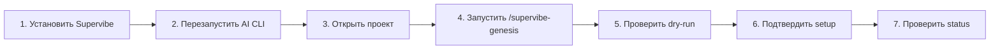
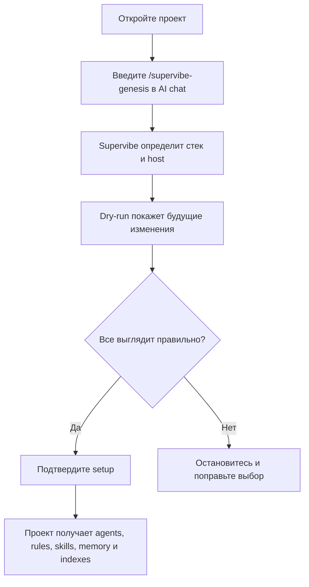
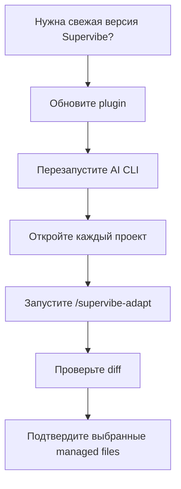

# Supervibe

[English](README.md) | [Русский](README.ru.md)

Supervibe превращает Claude Code, Codex, Gemini, Cursor и OpenCode в локальную команду AI-агентов для разработки. Он помогает AI-инструменту читать проект, строить карту кода, помнить решения, планировать изменения, проверять результат и помогать с дизайном.

Работает локально. Docker не нужен. Windows, macOS и Linux.

**v2.1** - текущий плагин `v2.1.33` - MIT - 2102 тестов

> **Compliance notice:** Supervibe предназначен только для помощи в разработке. Используя его, вы отвечаете за соблюдение Terms of Service (ToS) и Acceptable Use Policy (AUP) всех сервисов, включая Anthropic. Неразрешенная автоматизация, злоупотребление OAuth-токенами или нарушение правил сторонних сервисов остаются ответственностью пользователя.

## С чего начать

| Что нужно сделать | Куда идти | Первая команда |
|---|---|---|
| Установить Supervibe впервые | [Установка](#установка) | Выберите Windows или macOS/Linux |
| Подключить Supervibe к проекту | [Первый запуск в проекте](#первый-запуск-в-проекте) | `/supervibe-genesis` |
| Спланировать фичу | [Основные сценарии](#основные-сценарии) | `/supervibe-brainstorm "idea"` |
| Сделать UI или landing page | [Основные сценарии](#основные-сценарии) | `/supervibe-design <brief>` |
| Обновить сам плагин | [Обновление](#обновление) | `/supervibe-update` |
| Обновить уже настроенный проект | [Обновление](#обновление) | `/supervibe-adapt` |
| Проверить здоровье или починить установку | [Частые ошибки](#частые-ошибки) | Найдите свой симптом |

## Быстрый старт

Весь путь для новичка:



Простыми словами:

1. Один раз установите Supervibe.
2. Перезапустите Claude Code, Codex, Gemini, Cursor или OpenCode.
3. Откройте нужный проект.
4. Введите `/supervibe-genesis` в чат AI CLI.
5. Прочитайте dry-run перед подтверждением.
6. Подтвердите только те файлы, которые хотите отдать под управление Supervibe.
7. Проверьте состояние через `/supervibe --status` или `/supervibe-status`.

## Главное правило: где вводить команды

Это самое важное место, потому что здесь чаще всего путаются.

| Тип команды | Где вводить | Пример |
|---|---|---|
| Slash-команды | В чате Claude Code, Codex, Gemini, Cursor или OpenCode | `/supervibe-genesis` |
| Команды терминала | В PowerShell, Terminal, bash или zsh | `npm run supervibe:status` |
| Команды установки | В терминале вашей ОС | `irm ... | iex` |

> **Важно:** Не вводите `/supervibe-adapt` в PowerShell, bash или zsh. Команды с `/` работают в AI CLI-чате.

## Memory-safe запуск Node

Для крупных локальных проверок, особенно на Windows, используйте npm-алиасы с
ограничением памяти:

```powershell
npm run check:memory-safe
npm run test:memory-safe
npm run code:index:memory-safe
```

Общая обертка работает с любой командой:

```powershell
npm run node:memory-safe -- --max-old-space-size 6144 -- npm run check
```

Обертка добавляет только те `NODE_OPTIONS`, которые поддерживает текущий
runtime Node.js через `process.allowedNodeEnvironmentFlags`. Неподдерживаемые
флаги печатаются как skipped и не ломают запуск на версии Node.js пользователя.
По умолчанию используются `--max-old-space-size=4096` и
`--heapsnapshot-near-heap-limit=3`.

## Очистка runtime-процессов

Daemon-команды Supervibe регистрируют PID в `.supervibe/servers/` и в
`.supervibe/memory/runtime-cleanup-registry.json`. Чтобы сначала посмотреть,
какие старые локальные daemon-процессы будут затронуты:

```powershell
npm run supervibe:cleanup:unused:dry-run
```

Чтобы остановить неиспользуемые managed daemon-процессы старше стандартного
порога в 60 минут:

```powershell
npm run supervibe:cleanup:unused
```

Порог можно настроить через низкоуровневую команду:

```powershell
node scripts/supervibe-runtime-cleanup.mjs --unused --older-than-minutes 15 --dry-run
```

На Windows cleanup останавливает дерево managed Node-процесса, чтобы дочерние
процессы не оставались висеть после остановки родителя.

## Установка

Требования:

- Node.js 22.5+ с `node:sqlite`
- Git
- доступ к сети для загрузки ONNX-модели с HuggingFace

Если Node.js отсутствует или версия слишком старая, установщик сначала спросит разрешение на установку или обновление Node.js.

### macOS / Linux

```bash
curl -fsSL https://raw.githubusercontent.com/vTRKA/supervibe/main/install.sh | bash
```

### Windows PowerShell

```powershell
irm https://raw.githubusercontent.com/vTRKA/supervibe/main/install.ps1 | iex
```

Что делает установщик:

1. Скачивает или обновляет checkout плагина Supervibe.
2. Ставит зависимости через `npm ci`.
3. Скачивает или переиспользует ONNX-модель.
4. Подключает поддерживаемые локальные host-инструменты, например Claude Code, Codex и Gemini.
5. Запускает install lifecycle doctor.
6. Печатает следующие шаги.

После перезапуска вы должны увидеть примерно такое:

```text
[supervibe] welcome  plugin v2.1.20 initialized for this project
[supervibe] code RAG  N files / M chunks (fresh)
[supervibe] code graph  N symbols / M edges (X% resolved)
```

## Первый запуск в проекте

Установка плагина еще не подключает конкретный проект. Проект нужно настроить отдельно.



Введите в AI CLI-чате:

```text
/supervibe-genesis
```

Dry-run должен показать:

- найденный stack
- выбранные группы агентов
- rules и skills
- файлы memory и indexes
- изменения host-инструкций

Подтверждайте только после проверки. Managed-блоки Supervibe обновляет сам, а ваши пользовательские заметки остаются вашими.

## Основные сценарии

| Цель | Команда | Что произойдет |
|---|---|---|
| Понять, что делать дальше | `/supervibe` | Выберет безопасный следующий workflow |
| Новая идея | `/supervibe-brainstorm "idea"` затем `/supervibe-plan --from-brainstorm <spec-path>` | Превратит идею в spec и plan |
| UI, landing page или экран продукта | `/supervibe-design <brief>` | Сделает направление, prototype, preview, feedback loop и handoff |
| Выполнить готовый plan | `/supervibe-execute-plan <plan-path>` | Выполнит шаги с verification gates |
| Длинная задача с видимым состоянием | `/supervibe-loop --guided --file <graph.json>` | Запустит видимый и отменяемый loop |
| Security review | `/supervibe-security-audit` | Сначала даст read-only findings |
| Посмотреть задачи в браузере | `/supervibe-ui` | Откроет локальную control plane |
| Проверить здоровье | `/supervibe-status` или `/supervibe --status` | Покажет memory, RAG, graph, policy и workflow state |

### Безопасный путь планирования

Нормальный путь:

```text
brainstorm -> reviewed plan -> atomized epic -> safe execution
```

Text-first summary - режим по умолчанию для схем workflow: компактные таблицы, stage maps или ASCII-style объяснения прямо в summary. Browser previews нужны только для реальных UI/prototype/browser проверок.

Пример для копирования:

```text
/supervibe-brainstorm "idea"
/supervibe-plan --from-brainstorm .supervibe/artifacts/specs/example.md
/supervibe-plan --review .supervibe/artifacts/plans/example.md
/supervibe-loop --atomize-plan .supervibe/artifacts/plans/example.md --plan-review-passed
/supervibe-loop --guided --file .supervibe/memory/work-items/example-epic/graph.json
/supervibe-loop --epic example-epic --worktree
/supervibe-loop --status --epic example-epic
/supervibe-loop --resume .supervibe/memory/loops/example-run/state.json
/supervibe-loop --stop example-run
```

## Как работает безопасность

Supervibe старается сначала показать план, а уже потом менять файлы.

| Принцип | Что это значит |
|---|---|
| Dry-run сначала | Genesis, adapt, cleanup и многие workflow сначала показывают будущие изменения |
| Подтверждение пользователя | Вы решаете, когда managed files можно записывать |
| Confidence gates | Агенты должны показать verification перед словами “готово” |
| Локальная память | Решения проекта лежат в `.supervibe/memory/` |
| Границы провайдера | Provider prompts, rate limits, network/MCP approvals, secrets, billing, production mutations и credential changes не обходятся |

Autonomous execution is opt-in, not the default. По умолчанию Supervibe помогает с planning, review, status, diagnostics и dry-run artifacts.

## Обновление

Есть два разных действия: обновить плагин и обновить файлы Supervibe внутри проекта.



### 1. Обновить сам плагин

В AI CLI-чате:

```text
/supervibe-update
```

Или в терминале:

macOS / Linux:

```bash
curl -fsSL https://raw.githubusercontent.com/vTRKA/supervibe/main/update.sh | bash
```

Windows PowerShell:

```powershell
irm https://raw.githubusercontent.com/vTRKA/supervibe/main/update.ps1 | iex
```

### 2. Обновить уже настроенный проект

Откройте проект, где раньше запускался `/supervibe-genesis`, и введите в AI CLI-чате:

```text
/supervibe-adapt
```

`/supervibe-adapt` сравнит agents, rules, skills, host instruction blocks и `.supervibe/memory/.supervibe-version` с новой версией Supervibe. Он сначала покажет dry-run и сохранит пользовательские секции.

> **Важно:** Не удаляйте agents, rules или skills вручную для обновления проекта. Для этого есть `/supervibe-adapt`.

## Что входит в Supervibe

| Возможность | Простыми словами |
|---|---|
| Agents-специалисты | Разные роли для planning, design, debugging, review и safety |
| Project memory | Повторно использует решения, а не спрашивает одно и то же |
| Code search и code graph | Находит связанные файлы и вызовы перед изменениями |
| Confidence gates | Требует доказательства перед “готово” |
| Local workflows | Запускает setup, design, review, preview и status локально |

Поддерживаемые stack: Laravel, Next.js, Nuxt, Vue, Svelte, React, Express, Fastify, NestJS, FastAPI, Django, Rails, Spring, ASP.NET, Go, Flutter, iOS, Android, Chrome MV3, GraphQL, PostgreSQL, MySQL, MongoDB, Elasticsearch и Redis.

## Команды

### Slash-команды

Вводятся в AI CLI-чате.

| Команда | Что делает |
|---|---|
| `/supervibe` | Выбирает следующий безопасный шаг |
| `/supervibe-genesis` | Первый setup проекта |
| `/supervibe-brainstorm <topic>` | Превращает идею в spec |
| `/supervibe-plan [<spec-path>]` | Делает implementation plan |
| `/supervibe-execute-plan [<plan-path>]` | Выполняет plan с gates |
| `/supervibe-loop --request/--plan/--from-prd` | Видимый loop со status, resume и stop |
| `/supervibe-design <brief>` | Design pipeline от направления до prototype и handoff |
| `/supervibe-security-audit` | Сначала read-only security audit |
| `/supervibe-ui` | Локальная browser control plane |
| `/supervibe-preview` | Управление preview servers |
| `/supervibe-update` | Обновляет plugin |
| `/supervibe-adapt` | Обновляет managed files проекта после update |

### Команды терминала

Вводятся в PowerShell, Terminal, bash или zsh.

| Команда | Что делает |
|---|---|
| `npm run supervibe:status` | Проверка indexes и workflow state |
| `npm run supervibe:doctor -- --host all` | Диагностика host registration |
| `npm run supervibe:install-doctor` | Post-install audit |
| `npm run supervibe:upgrade` | Ручное обновление plugin checkout |
| `npm run supervibe:upgrade-check` | Проверка новых commits upstream |
| `npm run supervibe:docs-audit` | Audit пользовательских docs |
| `npm run check` | Полная maintainer validation suite |

## Частые ошибки

| Симптом | Что делать |
|---|---|
| После установки нет banner | Повторите install, полностью перезапустите AI CLI, затем проверьте `.supervibe/audits/install-lifecycle/latest.json` |
| Slash-команду ввели в terminal | Перенесите ее в AI CLI-chat; terminal не понимает `/supervibe-*` |
| Zed с Codex ACP не показывает Supervibe после `/` | Повторите install, перезапустите Zed external-agent session, затем `npm run supervibe:doctor -- --host codex --strict` |
| `Protobuf parsing failed` | Повторите install; ONNX model отсутствует, повреждена или скачалась не полностью |
| Model download идет долго | Дождитесь; installer не ставит total или stall timeout для HuggingFace ONNX download |
| Windows install запускается в WSL | Используйте PowerShell `install.ps1`, если нужен Windows install |
| SQLite errors | Установите Node.js 22.5+ или повторите installer и подтвердите Node upgrade |
| PowerShell блокирует install | Выполните `Set-ExecutionPolicy -Scope Process Bypass`, затем повторите install |

## Удаление

Удаление plugin и удаление данных проекта - разные вещи.

### Удалить plugin

macOS / Linux:

```bash
rm -rf ~/.claude/plugins/marketplaces/supervibe-marketplace
rm -rf ~/.codex/plugins/cache/supervibe-marketplace/supervibe
rm -f  ~/.codex/plugins/supervibe
rm -rf ~/.agents/skills/supervibe
```

Если есть `[plugins."supervibe@supervibe-marketplace"]` в `~/.codex/config.toml`, удалите эту запись.

### Удалить Supervibe из одного проекта

Только если больше не нужна память, plans, loop state и audit evidence проекта:

```bash
rm -rf .supervibe
```

Если история проекта нужна, оставьте `.supervibe/`.
