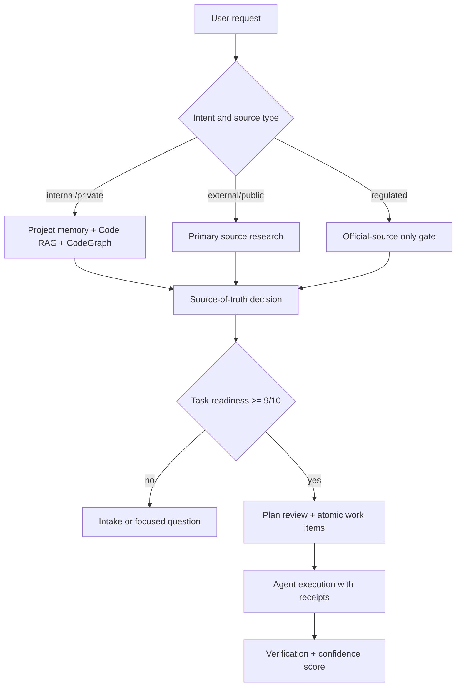

# Agent System Coverage Matrix

This document is the durable coverage contract for audit, research, planning, source-of-truth validation, and visual explanation flows. It is intentionally testable: scenario fixtures and maturity reports should cite these rows instead of relying on ad hoc controller judgment.

## Coverage Matrix

| User intent | Command | Skill | Primary agents | Gates | Eval fixture |
| --- | --- | --- | --- | --- | --- |
| Internal application or private-source audit | `/supervibe-audit --docs` or `/supervibe-audit --memory` | `supervibe:audit`, `supervibe:project-memory`, `supervibe:code-search` | `supervibe-orchestrator`, `repo-researcher`, `memory-curator`, `quality-gate-reviewer` | command routing, project memory, Code RAG, CodeGraph, confidence scoring, workflow receipt | `internal-application-audit` |
| External research or public-source audit | `/supervibe-audit --source-of-truth` | `supervibe:audit`, `supervibe:strengthen`, `supervibe:confidence-scoring` | `repo-researcher`, `best-practices-researcher`, `quality-gate-reviewer` | source hierarchy, freshness check, source conflict log, citation check | `external-research-source-truth` |
| Source-of-truth conflict resolution | `/supervibe-audit --source-of-truth` | `supervibe:audit`, `supervibe:explore-alternatives` | `repo-researcher`, `quality-gate-reviewer` | authority tier selection, conflict decision, validation command or cited primary source | `source-of-truth-conflict-resolution` |
| Raw task prevention before agents start | `/supervibe-plan --intake` | `supervibe:requirements-intake`, `supervibe:writing-plans` | `supervibe-orchestrator`, `product-owner`, `quality-gate-reviewer` | intake completeness, assumptions, acceptance criteria, atomic work split, readiness score | `raw-task-prevention` |
| Plan review and execution readiness | `/supervibe-plan --review`, `/supervibe-loop --atomize-plan`, `/supervibe-execute-plan` | `supervibe:writing-plans`, `supervibe:executing-plans` | `supervibe-orchestrator`, `repo-researcher`, `qa-test-engineer`, `quality-gate-reviewer` | mandatory review loop, atomization, verification plan, confidence gate | `plan-review-required-before-execution` |
| Workflow-chain maturity audit for brainstorm, plan, execute-plan, and loop | `/supervibe-audit --workflow-chain` | `supervibe:audit`, `supervibe:project-memory`, `supervibe:code-search`, `supervibe:confidence-scoring` | `supervibe-orchestrator`, `repo-researcher`, `memory-curator`, `quality-gate-reviewer` | end-to-end user-case coverage, agent handoff checks, feature-bloat guard, pitfall review, validation and receipt gates | `workflow-chain-maturity-audit` |
| Multi-plugin host instruction coexistence | `/supervibe-genesis`, `/supervibe-adapt` dry-run context migration | `supervibe:genesis`, `supervibe:adapt`, `supervibe:verification` | `supervibe-orchestrator`, `quality-gate-reviewer` | preserve user sections, preserve external managed blocks, preserve other Supervibe adapter blocks, no overwrite outside target managed block | `multi-plugin-host-instruction-coexistence` |
| Visual chat explanation of system or task logic | `/supervibe-plan --diagram` | `supervibe:writing-plans`, `supervibe:design-intelligence` | `supervibe-orchestrator`, `ux-ui-designer`, `quality-gate-reviewer` | Mermaid or ASCII fallback, accessible text summary, no hidden implementation claims | `visual-chat-explanation-required` |
| External design reference to multi-variant prototype | `/supervibe-design` | `supervibe:design-intelligence`, `supervibe:mcp-discovery`, `supervibe:landing-page`, `supervibe:prototype` | `supervibe-orchestrator`, `creative-director`, `ux-ui-designer`, `prototype-builder`, `quality-gate-reviewer` | reference source scope, IA borrow when user says same structure, reference inventory before creative direction, explicit variant count, style-difference matrix, no visual copying without approval | `design-reference-structure-five-variants` |
| Regulated domain audit: legal, finance, health, government, security | `/supervibe-audit --source-of-truth --regulated` | `supervibe:audit`, `supervibe:confidence-scoring`, `supervibe:verification` | `security-auditor`, `repo-researcher`, `quality-gate-reviewer` | primary-source only, current-date check, conservative answer, no unsupported advice | `regulated-domain-evidence` |
| Plugin update or local plugin drift repair | `npm run supervibe:upgrade` | `supervibe:verification`, `supervibe:audit` | `supervibe-orchestrator`, `quality-gate-reviewer` | managed checkout drift restore, mirror clean assertion, install doctor | `plugin-update-local-drift` |

## Source Of Truth Hierarchy

Tier 1 sources are authoritative and win conflicts: repository code, committed Supervibe docs, official vendor docs, standards, protocol specifications, changelogs, security advisories, CVE/NVD/GHSA/CISA records, signed release metadata, and user-provided private source content.

Tier 2 sources are project-local evidence: project memory, Code RAG chunks, CodeGraph symbols, test output, workflow receipts, audit artifacts, and host adapter state. Tier 2 can decide project behavior, but it must defer to Tier 1 for external facts and security or compliance claims.

Tier 3 sources are supporting context: reputable public articles, examples, community discussions, benchmark posts, and product pages. Tier 3 can explain patterns, but cannot override Tier 1 or Tier 2.

Conflict rule: cite the conflict, select the highest tier, state the validation command or citation, and record the unresolved assumption if the conflict cannot be closed.

## Research And Audit Readiness Gate

An audit or research task is ready only when the agent has:

- a scoped question and out-of-scope boundary;
- target source family: internal/private, external/public, mixed, or regulated;
- source hierarchy and freshness requirement;
- at least one validation path: command output, fixture, screenshot, official citation, or user-provided document;
- confidence rubric and fail condition.

If any item is missing, the route must use intake or ask one focused question before assigning worker agents.

## Internal And Private Sources

Internal application audits must prefer project memory, repo files, Code RAG, CodeGraph, local docs, tests, logs, receipts, and user-provided documents. The agent must not browse for private facts unless the user explicitly asks for external comparison. Private evidence must be summarized without exposing secrets, credentials, personal data, or proprietary content.

## External Research Sources

External research must use current primary sources when facts can change. For libraries and APIs, prefer official docs, release notes, OpenAPI specs, source repositories, and standards. For security, prefer advisories and vendor bulletins. For pricing, laws, schedules, policies, and product capabilities, verify live source state before answering.

## Regulated Domain Policies

Legal, finance, health, government, security, compliance, and identity tasks require conservative source selection. The agent must use official or primary sources, include date-aware validation, avoid unsupported advice, and label any inference. A single stale tutorial or unattributed summary is never enough.

## Raw Task Prevention

Agents should not receive raw tasks that lack acceptance criteria, scope, source context, or verification. The controller must convert a request into a task packet with:

- problem statement;
- user outcome;
- source-of-truth plan;
- artifacts to read;
- acceptance checks;
- verification commands;
- rollback or stop condition;
- confidence target.

Tasks below readiness score 9/10 stay in intake or planning.

## Host Instruction Coexistence

Host instruction files such as `AGENTS.md`, `CLAUDE.md`, `GEMINI.md`, `.cursor/rules/*.mdc`, and OpenCode instruction surfaces can be shared by user rules, Supervibe managed blocks, and third-party plugin managed blocks. Supervibe migration is allowed to replace only the exact target `SUPERVIBE:BEGIN managed-context <adapter>` block. If that block is missing, Supervibe appends a new block after existing content.

The migrator must preserve:

- user-authored headings and prose outside managed blocks;
- external managed blocks such as `OTHERPLUGIN:BEGIN managed-context`;
- other Supervibe adapter blocks in the same file, for example `opencode` while writing `codex`;
- imports and include directives.

Dry-run output must report preserved external managed blocks and other Supervibe adapter blocks so multi-plugin coexistence is testable before any write.

## Visual Chat Explanation Policy

When the user asks to understand logic, task flow, architecture, or audit process, the answer should include a compact visual artifact when it improves comprehension. Mermaid is preferred for flows and dependencies; ASCII is acceptable for terminal-only contexts. Every diagram needs a short text fallback so it remains useful in clients that do not render diagrams.

Text fallback: request -> source type -> evidence -> source-of-truth decision -> readiness gate -> plan review -> agent execution -> verification.

## Negative Source Patterns

Reject these patterns before an audit is marked ready:

- single unverified blog post for a changing fact;
- stale tutorial overriding official docs;
- generated answer without citations for regulated claims;
- project memory overriding current code;
- command output from the wrong working directory;
- screenshots without URL, timestamp, or target description;
- hand-written receipts for delegated agent work;
- plan that lacks verification commands or acceptance checks.

## Runtime Telemetry And Maturity Dashboard

The maturity dashboard must report the state of user-case coverage, source-of-truth coverage, visual explanation coverage, update self-heal, scenario fixtures, Code RAG, CodeGraph, workflow receipts, and content validators. A 10/10 claim is allowed only when the dashboard, scenario evals, `supervibe-agent-maturity`, and `npm run check` pass.
