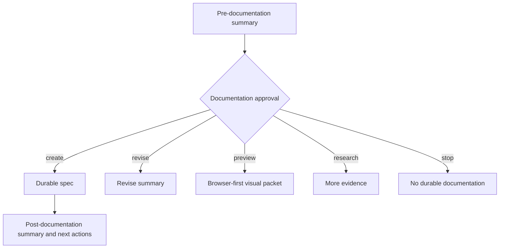

# Visual Explanation Standard

Supervibe agents should not explain complex work only as prose when a compact
visual model would reduce ambiguity. Visual output is a comprehension aid, not
decoration.

## When To Visualize

Use a visual when the artifact contains one of these shapes:

- Workflow or decision path: browser-first visual packet with readable cards,
  lanes, or steps.
- Actor/system interaction: browser-first visual packet with swimlanes or
  timeline rows.
- Entity lifecycle or status field: browser-first state board with labels.
- Architecture boundary or ownership: browser-first boundary map with explicit
  owner, trust, and data labels.
- Prioritization, comparison, or evidence matrix: Markdown table when a table is
  clearer than a rendered preview.

Do not add a diagram when a short list is clearer, when the user asked for terse
output, or when the diagram would repeat the same labels without clarifying
dependencies, states, trust boundaries, or release gates.

## Minimum Contract

Every generated visual explanation must include:

- `Visual mode`: browser-first preview, table-only approved, or fallback export.
- `Preview`: a local HTML path or URL when browser-first mode is used.
- `Text fallback`: the same states, edges, decisions, and stop conditions in
  plain language.
- `Audience summary`: one beginner-readable explanation and one implementer note
  when the topic is technical.
- Labels on important arrows, transitions, states, owners, and risks.
- No color-only status encoding.
- A node or card budget: about 12 cards before splitting.
- If Mermaid is emitted as fallback/export, it must include `accTitle` and
  `accDescr`.

## Standard Patterns

### Browser-First Process

Create a small HTML/CSS packet under
`.supervibe/artifacts/visual-explanations/<slug>/index.html` and serve it with
`/supervibe-preview <dir> --daemon` when the user benefits from seeing the flow.
The first screen should show the actual decision or workflow, not a decorative
landing page.

Required packet sections:

- Header: title, status, artifact source, and date.
- Flow lanes: approved input, decision gate, durable artifact, review or
  execution gate, and stop path.
- Decision cards: continue, revise, defer, and stop choices when a user decision
  is required.
- Evidence strip: memory, RAG, CodeGraph, validator, and confidence evidence.
- Text fallback: compact prose for clients without preview rendering.

Text fallback: approved scope becomes a reviewed plan, then implementation,
verification, release, and post-release learning.

### Table-Only Visual

Use a Markdown table when the user needs comparison more than a diagram:

| Step | Decision | Evidence | Stop condition |
|------|----------|----------|----------------|
| Summary | User understands the proposed artifact | problem, scope, risk | summary rejected |
| Approval | User chooses whether to write documentation | explicit choice | no durable write |
| Artifact | Documentation is written and validated | validator output | validation fails |
| Next action | User chooses plan, revise, research, defer, or stop | next action menu | user stops |

### Mermaid Fallback Or Export

Mermaid is acceptable when browser preview is unavailable or the user explicitly
asks for raw diagram text. Treat it as fallback/export, not the primary
explanation.

Text fallback: show summary, ask for documentation approval, write the spec only
when approved, then summarize the saved artifact and next choices.

## Verification

Before claiming a visual artifact is ready:

- Verify the browser-first packet has a preview URL/path or an explicit
  table-only approval reason.
- Check that the text fallback names every critical node, edge, decision, and
  stop condition.
- Check that raw Mermaid fallback, when present, includes `accTitle` and
  `accDescr`.
- For UI previews, use Playwright or a local screenshot to verify text does not
  overlap and visual content is not blank.

## Source Basis

- Mermaid accessibility: https://mermaid.js.org/config/accessibility.html
- Mermaid syntax reference: https://mermaid.js.org/intro/syntax-reference.html
