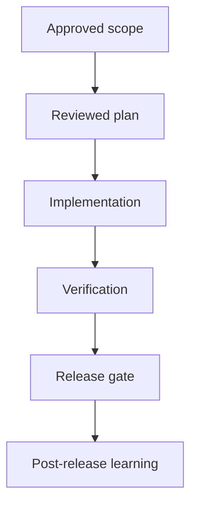
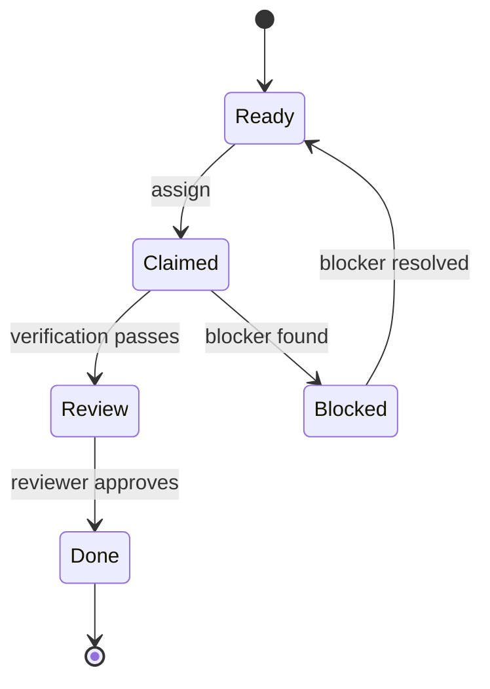

# Visual Explanation Standard

Supervibe agents should not explain complex work only as prose when a compact
visual model would reduce ambiguity. Visual output is a comprehension aid, not
decoration.

## When To Visualize

Use a visual when the artifact contains one of these shapes:

- Workflow or decision path: Mermaid `flowchart`.
- Actor/system interaction: Mermaid `sequenceDiagram`.
- Entity lifecycle or status field: Mermaid `stateDiagram-v2`.
- Architecture boundary or ownership: C4-style context/container diagram in
  Mermaid flowchart syntax.
- Prioritization, comparison, or evidence matrix: Markdown table.

Do not add a diagram when a short list is clearer, when the user asked for terse
output, or when the diagram would repeat the same labels without clarifying
dependencies, states, trust boundaries, or release gates.

## Minimum Contract

Every generated diagram must include:

- `accTitle` or a title comment when the renderer supports it.
- `accDescr` with a plain-language summary.
- A text fallback that communicates the same states, edges, or decisions.
- Labels on important arrows or transitions.
- No color-only status encoding.
- A node budget: about 12 nodes per diagram before splitting.

## Standard Patterns

### Process

Text fallback: approved scope becomes a reviewed plan, then implementation,
verification, release, and post-release learning.

### State

Text fallback: work starts ready, can be claimed, blocked, reviewed, and only
closes after review approval.

## Verification

Before claiming a visual artifact is ready:

- Render or lint the Mermaid syntax when a renderer is available.
- Check that the text fallback names every critical node and edge.
- Check that `accTitle` and `accDescr` are present.
- For UI previews, use Playwright or a local screenshot to verify text does not
  overlap and visual content is not blank.

## Source Basis

- Mermaid accessibility: https://mermaid.js.org/config/accessibility.html
- Mermaid syntax reference: https://mermaid.js.org/intro/syntax-reference.html
