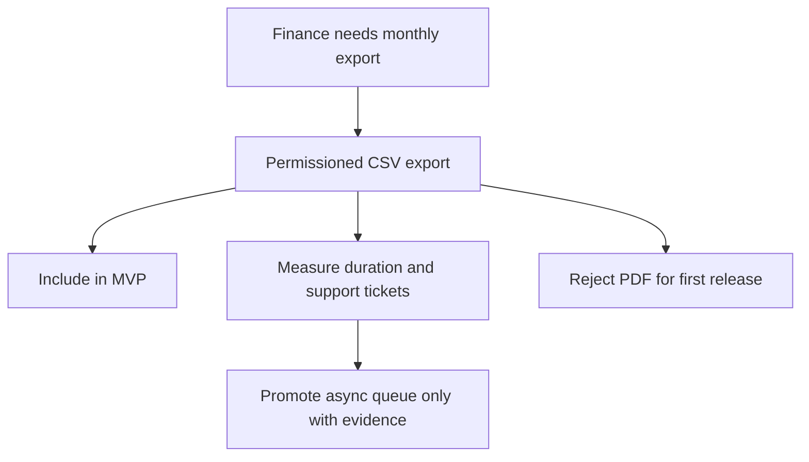

# Brainstorm: Billing Export MVP

Use this as a canonical brainstorm output. It must turn ambiguity into a scoped product decision, not a list of ideas.

**Date:** 2026-05-11
**Time-box:** 30 min
**Status:** done

---

## Problem statement

Finance cannot complete monthly reconciliation without engineering-owned SQL exports. The MVP should provide a self-serve export path that is permissioned, auditable, reversible, and small enough to ship without queue operations unless performance evidence proves otherwise.

---

## First-principle decomposition

### Constraints
- Use the current billing data model and permission system.
- Do not expose raw payment fields, tokens, or unrelated customer PII.
- Keep the first release reversible through a feature flag or route exposure change.

### Success criteria
- Finance exports approved invoice rows without engineering help.
- Integration tests cover success, validation error, authorization error, and CSV injection escaping.
- Staging export of 10000 rows completes within 2s or triggers a documented follow-up.

### Failure modes
- CSV formula injection executes in spreadsheet tools.
- Month filters use the wrong timezone and produce incomplete exports.
- Support role receives data it should not see.
- Large customers hit timeout or memory pressure.

### Non-goals
- PDF export, scheduled reports, analytics dashboards, and background jobs in the first release.

---

## Evidence and retrieval plan

### Project memory
- Query: billing export, permission boundary, CSV, audit event.
- Relevant entries: record matching memory ids or state that no prior memory exists.
- Decision impact: prior permission or audit decisions override convenience defaults.

### RAG and CodeGraph
- Code RAG query plan: billing routes, export service patterns, authorization middleware, audit logging, CSV utilities.
- CodeGraph needed? yes, if route, service, or permission contracts change.
- Graph evidence required before implementation: callers of billing route registry, permission helpers, and audit event emitter.
- Citation expectations: every implementation task cites files or tests that establish the local pattern.

### Research basis
- Official docs / primary sources: CSV injection handling guidance from a trusted security source if the repo lacks a pattern.
- Competitive or reference products: only if product copy or UX expectations are unclear.
- Stale facts that must be re-checked before planning: third-party billing provider export limits, if a provider API is involved.

---

## Product and MVP fit

### Project type
- MVP production feature.

### MVP delivery path
- Discovery evidence: finance job, current manual workaround, permission and privacy constraints.
- Requirements and contracts needed: PRD, API contract if a new endpoint or event is introduced, implementation plan.
- Implementation phases: route contract, service behavior, authorization and audit logging, UI integration if needed, release gate.
- Verification levels: unit, integration, security, performance smoke, rollback check.
- Release and rollout model: internal finance cohort, then production cohort after metric review.
- Production owner / support path: backend owner for code, support lead for escalation note.

### MVP slice
- Smallest useful release: synchronous CSV export with approved columns, role check, audit event, and documented error behavior.
- What waits for v2: async job, scheduled delivery, PDF, analytics.
- Kill / pivot signal: export exceeds 30s for 10000 rows or privacy review rejects the proposed column set.

---

## Scope Safety Gate

### Scope baseline
- Core outcome: finance can export approved invoice rows without engineering.
- Must-have for current release: CSV schema, permission check, audit event, error contract, tests, rollback path.
- Should-have if cheap: admin UI entry point and support note.
- Could-have later: async export and scheduled reports.
- Won't-have now: PDF export and analytics dashboards.

### Add / defer / reject decisions
| Candidate addition | Decision | Evidence | Complexity cost | Tradeoff |
|--------------------|----------|----------|-----------------|----------|
| Synchronous CSV export | include | direct finance job | low | fastest user value |
| Async export queue | defer | no performance failure yet | medium | avoids queue operations |
| PDF export | reject | no current user evidence | high | avoids layout and QA surface |
| Scheduled delivery | defer | separate workflow | medium | keeps first release reversible |

### Why-not rationale
- Additions that would hurt the project now: queue operations, PDF layout, and analytics increase support and verification cost before the core job is proven.
- Smallest production-safe alternative: ship synchronous export with a measured async trigger.
- Evidence required to promote deferred items: failing performance budget, repeated support tickets, or explicit paid workflow.

---

## Visual explanation plan

### Diagram type
- Mermaid flowchart.

### Audience levels
- Beginner summary: finance requests export, system checks permission, export succeeds or returns a clear error.
- Engineer detail: route validates filters, service streams approved rows, audit event records outcome.
- Operator/release view: feature flag controls exposure, metrics and alerts show failures, rollback hides the route.

### Accessibility
- `accTitle`: Billing export MVP decision flow
- `accDescr`: The diagram shows the include/defer/reject decision path for the export MVP.
- Text fallback: include only the synchronous CSV export now; defer queue and scheduled delivery until measured evidence exists; reject PDF for the first release.
- Do not rely on color alone: labels and text identify every branch.

### Required visual

---

## Competitive scan (if applicable)

| Product | Approach | What's good | What's bad |
|---------|----------|-------------|------------|
| Stripe dashboard | CSV export with role controls | familiar admin workflow | exact limits may not match this product |
| Internal SQL export | engineering-owned pull | quick for one-off cases | not auditable or self-serve |

---

## Stakeholder map (if applicable)

| Stakeholder | Concern | Influence (1-5) | Notify when |
|-------------|---------|-----------------|-------------|
| Finance admin | complete monthly close | 5 | PRD approval and rollout |
| Support lead | safe billing answers | 4 | error behavior and support note |
| Privacy reviewer | PII minimization | 5 | column list changes |
| Backend owner | maintainability and rollback | 5 | implementation plan review |

---

## Options explored

### Option A: Synchronous CSV export
Add a permissioned endpoint that validates filters, streams approved rows, logs an audit event, and remains behind a feature flag.

### Option B: Async export job
Queue export work, store generated files, notify users when ready, and add cleanup/retention operations.

### Option C: Status quo
Keep manual SQL export through engineering requests.

---

## Non-obvious risks

- Spreadsheet formula injection through exported cells.
- Timezone mismatch at month boundaries.
- Support users receiving finance-only fields.
- Audit event containing raw filters with PII.
- Browser cancellation creating partial download confusion.

---

## Kill criteria

- Kill or pivot if privacy review rejects the approved column list.
- Kill synchronous-only scope if 10000-row export exceeds 30s in staging.
- Kill release if authorization failures lack a documented user-facing error.

---

## Decision matrix

| Dimension | Weight | A | B | C |
|-----------|--------|---|---|---|
| User impact | 3 | 8 | 9 | 1 |
| Delivery speed | 2 | 8 | 4 | 10 |
| Operational simplicity | 2 | 8 | 3 | 9 |
| Privacy and auditability | 3 | 8 | 8 | 2 |
| Reversibility | 2 | 8 | 5 | 10 |
| **Total** | -- | 104 | 85 | 67 |

Weights set before scores.

---

## Recommended option

Choose Option A. It directly solves the finance job, keeps rollback simple, and preserves a clear evidence trigger for Option B.

---

## Production readiness contract

### Functional contracts
- Inputs / outputs: date filters, account scope, CSV schema, and documented error body.
- API / event / data contracts: export endpoint, audit event, approved invoice fields.
- State transitions: request accepted, validation rejected, authorization rejected, export completed, export cancelled.
- Error envelope: validation, authorization, rate-limit, timeout, and cancellation outcomes.

### Non-functional contracts
- Security and privacy: role check, PII minimization, CSV injection escaping, redacted logs.
- Performance / SLO: 2s for 10000 staging rows; async trigger at 30s.
- Accessibility / i18n: readable error text and stable CSV headers for MVP.
- Observability: export duration, failure count, audit event, correlation id.
- Backup / rollback: feature flag hides the route and UI entry point.

### Verification strategy
- Unit: CSV escaping, filter parsing, schema mapping.
- Integration: success, validation error, authorization error, cancellation.
- E2E / smoke: finance admin export happy path if UI is included.
- Release gate: performance smoke, audit event check, rollback check, support note review.

---

## Acceptance and 10/10 scorecard

| Dimension | 10/10 requirement | Evidence |
|-----------|-------------------|----------|
| User outcome | finance exports without engineering | integration or smoke evidence |
| Contract completeness | endpoint, schema, error, audit, and permission contracts explicit | API contract or tests |
| Edge cases | invalid filters, no rows, large rows, cancellation, CSV injection covered | test names and outputs |
| Security/privacy | approved fields only and redacted logs | security tests or review |
| Operability | metrics, audit event, support note, and rollback path ready | release gate output |
| Verification | targeted and full checks pass | command output |
| Release readiness | no critical blocker remains | plan review or final gate |

- 10/10 gate: every row has evidence, no open blockers, and all release gates pass.

---

## Open questions

- Confirm approved export columns.
- Confirm permission name and role mapping.
- Confirm timezone for month filters.

---

## Next step

- [ ] PRD when product scope needs explicit approval.
- [ ] Plan when PRD, contract, risks, and verification are ready.
- [ ] More brainstorm only if approved columns, permission owner, or release path remain ambiguous.
