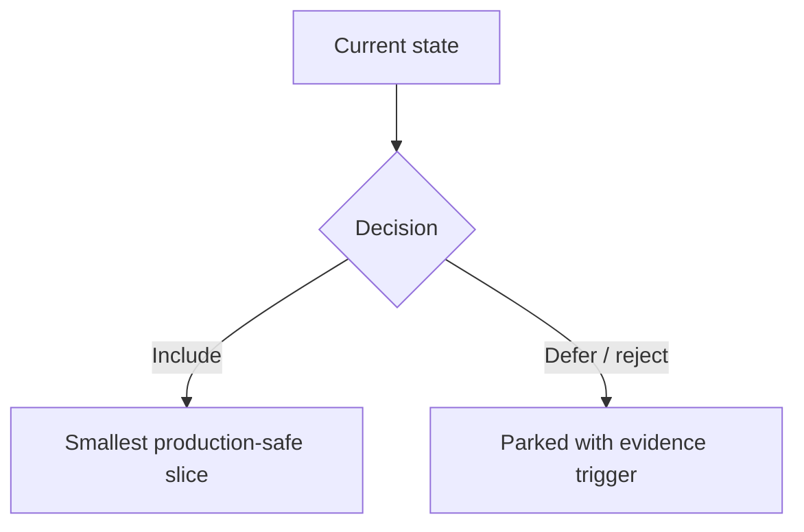

# Brainstorm: <Topic>

**Date:** YYYY-MM-DD
**Time-box:** <e.g., 30 min>
**Status:** in-progress | done | parked

---

## Problem statement

<1 paragraph>

---

## First-principle decomposition

### Constraints
- ...

### Success criteria
- ...

### Failure modes
- ...

### Non-goals
- ...

---

## Evidence and retrieval plan

### Project memory
- Query:
- Relevant entries:
- Decision impact:

### RAG and CodeGraph
- Code RAG query plan:
- CodeGraph needed? yes / no
- Graph evidence required before implementation:
- Citation expectations:

### Research basis
- Official docs / primary sources:
- Competitive or reference products:
- Stale facts that must be re-checked before planning:

---

## Product and SDLC fit

### Project type
- MVP | production feature | migration | experiment | refactor | incident follow-up

### SDLC path
- Discovery evidence:
- Requirements and contracts needed:
- Implementation phases:
- Verification levels:
- Release and rollout model:
- Production owner / support path:

### MVP slice
- Smallest useful release:
- What waits for v2:
- Kill / pivot signal:

---

## Scope Safety Gate

### Scope baseline
- Core outcome:
- Must-have for current release:
- Should-have if cheap:
- Could-have later:
- Won't-have now:

### Add / defer / reject decisions
| Candidate addition | Decision | Evidence | Complexity cost | Tradeoff |
|--------------------|----------|----------|-----------------|----------|
| ... | include / defer / reject / spike | ... | ... | ... |

### Why-not rationale
- Additions that would hurt the project now:
- Smallest production-safe alternative:
- Evidence required to promote deferred items:

---

## Visual explanation plan

### Diagram type
- Mermaid flowchart / sequence diagram / stateDiagram-v2 / C4-style context / table-only

### Audience levels
- Beginner summary:
- Engineer detail:
- Operator/release view:

### Accessibility
- `accTitle`:
- `accDescr`:
- Text fallback:
- Do not rely on color alone:

### Required visual

---

## Competitive scan (if applicable)

| Product | Approach | What's good | What's bad |

---

## Stakeholder map (if applicable)

| Stakeholder | Concern | Influence (1-5) | Notify when |

---

## Options explored

### Option A: <name>
<1 paragraph>

### Option B: <name>

### Option C: <name> (do nothing / status quo)

---

## Non-obvious risks

- ...

---

## Kill criteria

- ...

---

## Decision matrix

| Dimension | Weight | A | B | C |
|-----------|--------|---|---|---|
| **Total** | -- | ... | ... | ... |

(weights set BEFORE scores)

---

## Recommended option

<Choice + rationale>

---

## Production readiness contract

### Functional contracts
- Inputs / outputs:
- API / event / data contracts:
- State transitions:
- Error envelope:

### Non-functional contracts
- Security and privacy:
- Performance / SLO:
- Accessibility / i18n:
- Observability:
- Backup / rollback:

### Verification strategy
- Unit:
- Integration:
- E2E / smoke:
- Release gate:

---

## Acceptance and 10/10 scorecard

| Dimension | 10/10 requirement | Evidence |
|-----------|-------------------|----------|
| User outcome | | |
| Contract completeness | | |
| Edge cases | | |
| Security/privacy | | |
| Operability | | |
| Verification | | |
| Release readiness | | |

- 10/10 gate: every row has evidence, no open blockers, and all release gates pass.

---

## Open questions

- ...

---

## Next step

- [ ] PRD
- [ ] ADR
- [ ] Plan
- [ ] More brainstorm (parked)
