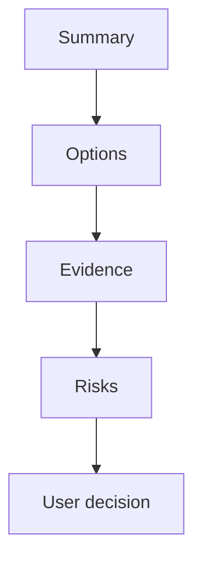

# Decision Brief: {topic}

Use this after brainstorm or plan review when a user needs to decide whether to continue, revise, defer, or stop. The brief must be specific enough to protect scope and clear enough for a non-specialist to approve.

## Executive Summary

- Plain-language outcome:
- Recommended action:
- Confidence:
- Main reason:
- Decision owner:
- Review date:
- Expiry or revisit trigger:

## User Decision

| Choice | When to choose it | Impact | Approval evidence |
| --- | --- | --- | --- |
| Continue | Scope, cost, verification, and risk are acceptable. | Move to the next gated phase. | approval receipt or chat reference |
| Revise | The idea is useful, but scope, sequencing, or contract detail is wrong. | Update the plan before work starts. | revision notes |
| Defer | The idea is valuable but not needed for this release. | Keep it out of current implementation. | deferred-scope owner |
| Stop | The idea does not meet current goals, evidence, or safety gates. | Archive the artifact and avoid execution. | stop rationale |

## Visual Explanation

Text fallback: read the summary, compare options, inspect evidence, review risks and cost, then choose one next action.

## Options

| Option | Benefit | Cost | Risk | Reversibility | Recommendation |
| --- | --- | --- | --- | --- | --- |
| Recommended | Highest verified value. | Known implementation cost. | Known and mitigated. | stated rollback path | Choose this unless a listed risk is unacceptable. |
| Smaller scope | Faster and safer. | Less value now. | May defer important work. | easier rollback | Choose this when delivery speed matters most. |
| Alternative approach | Different architecture or process. | Different operational cost. | Different failure mode. | compare before approval | Choose this when evidence favors the tradeoff. |
| Defer | No current implementation risk. | No near-term value. | Problem remains. | fully reversible | Choose this when evidence is weak. |

## Evidence And Assumptions

- Source citations:
- Project memory:
- CodeGraph or RAG evidence:
- External freshness checks:
- Assumptions:
- Assumption expiry:

## Risk And Tradeoff Summary

- Highest risk:
- Mitigation:
- Scope tradeoff:
- Complexity cost:
- Rollback path:
- Stop condition:

## Implementation Snapshot

- Architecture impact:
- API contract impact:
- Frontend integration impact:
- Data and privacy impact:
- Security impact:
- Observability impact:
- Task tracker impact:
- Support impact:

## Next User Actions

- [ ] Continue to the next gated phase.
- [ ] Revise the plan before implementation.
- [ ] Defer selected scope.
- [ ] Stop and archive the current artifact.

## Acceptance And Evidence

- 10/10 acceptance:
- Verification evidence:
- Source citations:
- Open blockers:
- Residual risks accepted:
- Owner:
