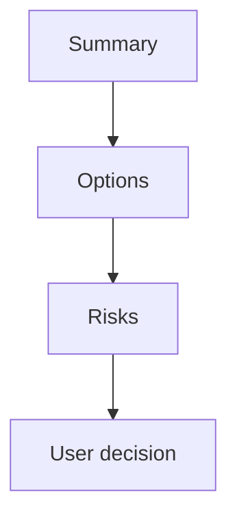

# Decision Brief Template

Use this after brainstorm or plan review when a nontechnical user needs to decide whether to continue, revise, defer, or stop.

## Executive Summary

- Plain-language outcome:
- Recommended action:
- Confidence:
- Main reason:

## User Decision

| Choice | When to choose it | Impact |
| --- | --- | --- |
| Continue | The scope, cost, and risk are acceptable. | Move to the next gated phase. |
| Revise | The idea is useful, but scope or sequencing is wrong. | Update the plan before work starts. |
| Defer | The idea is valuable but not needed for this release. | Keep it out of current implementation. |
| Stop | The idea does not meet current goals or safety gates. | Archive the artifact and avoid execution. |

## Visual Explanation

Text fallback: read the short summary, compare the options, inspect risks and cost, then select one next action.

## Options

| Option | Benefit | Cost | Risk | Recommendation |
| --- | --- | --- | --- | --- |
| Recommended | Highest verified value. | Known implementation cost. | Known and mitigated. | Choose this unless a listed risk is unacceptable. |
| Smaller scope | Faster and safer. | Less value now. | May defer important work. | Choose this when delivery speed matters most. |
| Defer | No current implementation risk. | No near-term value. | Problem remains. | Choose this when evidence is weak. |

## Risk And Tradeoff Summary

- Highest risk:
- Mitigation:
- Scope tradeoff:
- Rollback path:

## Implementation Snapshot

- Architecture impact:
- API contract impact:
- Frontend integration impact:
- Data and privacy impact:
- Task tracker impact:

## Next User Actions

- [ ] Continue to the next gated phase.
- [ ] Revise the plan before implementation.
- [ ] Defer selected scope.
- [ ] Stop and archive the current artifact.

## Acceptance And Evidence

- 10/10 acceptance:
- Verification evidence:
- Source citations:
- Open blockers:

