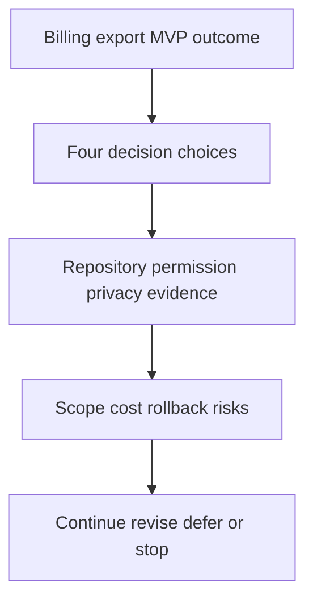

# Decision Brief: Billing Export MVP Scope

Use this after brainstorm or plan review when a user needs to decide whether to continue, revise, defer, or stop. A usable brief gives one recommended action, the reason behind it, the cost of alternatives, and the evidence needed for a non-specialist to approve.

## Executive Summary

- Plain-language outcome: billing operators can export a redacted CSV for the last 90 days of account billing events without asking engineering for a manual data pull.
- Recommended action: continue with the MVP export scope and reject scheduling, queueing, email delivery, and analytics for this release.
- Confidence: 8.8/10 before implementation, gated by local route and repository verification.
- Main reason: the MVP gives immediate operator value while keeping data ownership, privacy, rollback, and support complexity bounded.
- Decision owner: billing platform owner.
- Review date: 2026-05-11.
- Expiry or revisit trigger: revisit if the export needs more than 25,000 rows, recurring delivery, or customer-facing access.

## User Decision

| Choice | When to choose it | Impact | Approval evidence |
| --- | --- | --- | --- |
| Continue | The user accepts admin-only CSV export, 90-day range, redacted fields, and no scheduled jobs. | Move to implementation plan execution. | chat approval or workflow receipt tied to the plan |
| Revise | The user needs a different range, file format, permission model, or data column set. | Update PRD and plan before code changes start. | revision note with changed scope ids |
| Defer | Export is useful but less important than another MVP item. | Keep billing export out of the current implementation wave. | deferred-scope owner and revisit trigger |
| Stop | Privacy, operational risk, or product value is not acceptable. | Archive the artifact and avoid partial implementation. | stop rationale and owner |

## Visual Explanation

Text fallback: read the billing export outcome, compare the four choices, inspect evidence and assumptions, review scope and rollback risk, then choose one next action.

## Options

| Option | Benefit | Cost | Risk | Reversibility | Recommendation |
| --- | --- | --- | --- | --- | --- |
| Admin CSV MVP | Fastest useful operator capability with bounded privacy and rollback. | Backend route, export service, UI action, docs, tests. | Route or repository shape may require small adaptation. | Revert route and UI action; no migration. | Choose this for the current release. |
| Async export jobs | Handles larger datasets and background processing. | Queue, job state, retries, cleanup, support runbook. | More failure modes and longer rollout. | Harder because durable job state must be managed. | Defer until usage proves need. |
| Customer-facing export | Gives end users self-serve access. | Product design, permissions, notifications, support, legal review. | Higher privacy and abuse risk. | Harder because public UX and policy changes are involved. | Reject for this MVP. |
| No export | Avoids implementation risk now. | Operators continue asking engineering for manual pulls. | Manual data pulls remain slow and inconsistent. | Fully reversible because no change ships. | Choose only if privacy risk is unacceptable. |

## Evidence And Assumptions

- Source citations: current billing repository, admin route registration, permission helper, audit logging helper, package scripts, and docs location.
- Project memory: prior billing or export decisions that affect redaction, support, and rollout.
- CodeGraph or RAG evidence: callers and impact for billing repository read methods, admin route registration, and audit logging.
- External freshness checks: current PRD and task-quality practices were compared against public product requirements and INVEST-style task quality guidance.
- Assumptions: the repository already exposes enough billing event fields for CSV, existing admin permission model can guard export, and signed URL helper exists or can be added without secrets redesign.
- Assumption expiry: expires when local code search disproves route, repository, permission, or signing assumptions.

## Risk And Tradeoff Summary

- Highest risk: accidental exposure of customer or payment data in CSV, logs, tests, or screenshots.
- Mitigation: allowlist CSV columns, redaction tests, fixture review, audit log assertions, and no real PII in test data.
- Scope tradeoff: scheduling, queues, email delivery, analytics, and public customer export are deferred to protect the MVP.
- Complexity cost: the chosen MVP needs one service, one route, one typed client, one UI action, and focused tests.
- Rollback path: disable the UI action, remove route registration, revert the final commit, and keep manual support export as fallback.
- Stop condition: stop if implementation requires migration, background jobs, new credential handling, or broader permission redesign.

## Implementation Snapshot

- Architecture impact: one backend export service reads through billing repository and writes an audit event.
- API contract impact: one authenticated admin endpoint with stable request, response, and error envelope.
- Frontend integration impact: one dashboard action with loading, success, empty, error, retry, and forbidden states.
- Data and privacy impact: redacted allowlisted CSV columns only; no raw payment identifiers.
- Security impact: existing admin permission guard and short-lived signed URL.
- Observability impact: structured logs include correlation id, duration, row count, status, and error code.
- Task tracker impact: split into contract tests, backend implementation, frontend implementation, and release readiness.
- Support impact: support note explains range limit, redacted fields, fallback path, and escalation owner.

## Next User Actions

- [ ] Continue to the next gated phase with admin CSV MVP scope.
- [ ] Revise the plan before implementation by changing range, columns, permission, or rollout.
- [ ] Defer scheduled export, queueing, analytics, and customer-facing export.
- [ ] Stop and archive the billing export artifact.

## Acceptance And Evidence

- 10/10 acceptance: user chooses one next action and every accepted risk has owner, expiry, and rollback.
- Verification evidence: plan validator, template-quality validator, targeted tests, and final `npm run check` are named before implementation begins.
- Source citations: local repository paths and CodeGraph or RAG outputs are attached to the final plan.
- Open blockers: no blocker may remain for permission, redaction, rollback, or verification before execution.
- Residual risks accepted: performance above 25,000 rows and recurring export are accepted as out of scope for this MVP.
- Owner: billing platform owner.
