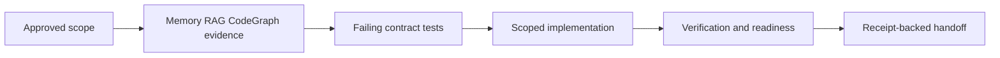

# Scoped Capability Implementation Plan

This is a neutral full-plan template. Keep the structure, replace the neutral capability labels with repository evidence, and do not approve the plan until every section contains concrete paths, owners, commands, risks, and scope decisions from the current project.

> **For agentic workers:** REQUIRED SUB-SKILL: use `supervibe:writing-plans` before approval and `supervibe:executing-plans` after approval. Durable outputs must be produced by real host agents or runtime tools with workflow receipts; inline notes are diagnostic only.

**Goal:** Deliver one user-approved capability as the smallest production-safe slice, with measurable behavior, verification evidence, rollback coverage, and no hidden optional functionality.

**Owner:** Named delivery owner for the capability and release gate.

**Architecture:** Add one bounded capability path through the existing ownership boundaries. New behavior must depend on established modules or explicitly approved new modules. The rejected approach is broad platform rewiring because it increases migration, review, support, and rollback cost without evidence that the current slice requires it.

**Tech Stack:** Node.js 22.5+, npm, `node:test`, repository-local scripts, existing runtime modules, existing documentation structure, and the narrow verification command selected for this capability.

**Constraints:** No production mutation during planning. No unapproved schema, permission, financial, security, infrastructure, or public API expansion. No private data in fixtures, logs, screenshots, or examples. The implementation must be reversible through source revert and documented operational rollback.

---

## AI/Data Boundary

| Area | Allowed | Redaction | Approval gate |
|------|---------|-----------|---------------|
| Local source reads | tracked repository files, tests, package scripts, generated indexes | secrets, tokens, private notes, unrelated local projects | none for tracked repository files |
| Local writes | scoped plan, tests, source files, docs, generated evidence requested by the plan | unrelated artifacts and private data | diff review before commit |
| MCP and browser automation | local tools needed for evidence, preview, or documentation checks | cookies, private payloads, private screenshots | user approval before private capture or writeback |
| Figma and design source | read-only design evidence when the capability requires it | unreleased brand assets and comments | explicit writeback approval |
| External network/API | public documentation and package metadata when freshness matters | request bodies, credentials, private responses | approval receipt for non-public targets |
| PII/secrets | references to field classes and redaction rules only | names, emails, tokens, account ids, private record ids | named approver and receipt before real data is used |

Blocked without exact approval: destructive production action, credential change, financial or access-control change, external writeback, and screenshots or fixtures containing private data.

---

## Retrieval, CodeGraph, And Visual Evidence

### Retrieval contract
- Project memory entries read: record the query, result count, top ids, confidence, and how the findings affect scope.
- Code RAG queries: record the exact query strings for the capability path, existing owner modules, tests, and release scripts.
- Top source citations: cite path and line or section for every claim about behavior, ownership, API, data shape, permissions, and rollback.
- Freshness checks: verify package scripts, current route names, current module boundaries, and active graph status from local files before finalizing tasks.

### CodeGraph contract
- Graph mode: use callers, callees, neighbors, or impact for any renamed symbol, moved module, shared API, or ownership boundary.
- Required commands are the source search and graph checks selected for the capability.
```bash
node scripts/search-code.mjs --context "capability owner module tests release gate" --limit 10
node scripts/search-code.mjs --impact "capability boundary" --depth 2
```
- Expected evidence: Case A callers found for reused helpers, Case B zero callers only for newly created helpers, or Case C graph not available with a concrete reason and reduced confidence.
- Resolution caveat: report source coverage, symbol coverage, edge resolution, and graph warnings before claiming 10/10 readiness.

### Visual explanation contract
- Visual mode: text-first visual summary with a compact stage table or ASCII flow. Browser preview is required only when the capability changes UI, prototype, or rendered docs.
- Audience: engineer, reviewer, and release owner.
- Accessibility: include a text fallback for the same information; if Mermaid fallback or export is emitted, include `accTitle` and `accDescr`.

| Stage | Meaning | Evidence | Stop condition |
|-------|---------|----------|----------------|
| Approved scope | user-approved capability and non-goals are fixed | PRD, plan, memory, RAG, CodeGraph | approval missing |
| Failing tests | contract tests define the behavior first | targeted test output | failure is syntax or environment only |
| Implementation | smallest scoped source change is built | source citations and diff | unapproved scope appears |
| Release gate | verification, rollback, docs, and support are complete | command output and release note | open blocker remains |



Text fallback: approved scope drives evidence collection, evidence drives failing tests, tests drive the scoped implementation, and release waits for verification, rollback, documentation, support, and receipt-backed handoff.

---

## Development Contract Map

| ID | Contract | Required details | Owner | Verification |
|----|----------|------------------|-------|--------------|
| C-BEH | Behavior contract | user-visible behavior, success state, edge cases, failure modes, and invariants | capability owner | targeted behavior tests |
| C-ARCH | Architecture contract | dependency direction, ownership boundary, module lifecycle, and rejected architecture | architecture owner | CodeGraph impact output and review |
| C-DATA | Data and schema contract | input fields, output fields, persistence, retention, redaction, and fixture shape | data owner | schema, fixture, and redaction tests |
| C-API | API and event contract | command, route, event, message, or error envelope surface touched by the plan | API owner | contract or integration tests |
| C-UI | UI state contract | loading, empty, success, error, permission, retry, and responsive states when UI changes | UI owner | component, screenshot, or smoke evidence |
| C-SEC | Security and privacy contract | permissions, secret handling, PII boundary, audit trail, and abuse cases | security owner | security and privacy assertions |
| C-PERF | Performance contract | latency, memory, concurrency, throughput, or scale budget for the slice | performance owner | benchmark, fixture, or bounded smoke check |
| C-OBS | Observability contract | logs, metrics, trace ids, result status, and operator repair output | operations owner | structured log or status assertion |
| C-ROLL | Rollout and rollback contract | staged release, feature flag, revert path, data rollback, and support fallback | release owner | rollback note and smoke check |
| C-DOC | Documentation and support contract | user docs, changelog, support note, known limits, and ownership | support owner | documentation review |

---

## File Structure

### Created
```text
src/capability/capability-service.mjs
tests/capability/capability-service.test.mjs
docs/capability/capability-runbook.md
```

### Modified
- `src/capability/existing-entrypoint.mjs` - connects the scoped capability to the existing owner boundary.
- `tests/capability/existing-entrypoint.test.mjs` - adds behavior and regression coverage for the owner boundary.
- `docs/capability/index.md` - records support, rollout, known limits, and rollback.

---

## Critical Path

`T1 -> T2 -> T-FINAL` is sequential.

Off-path parallel candidates after T1: documentation review and support copy can run separately when write sets are disjoint and receipt-backed. Implementation and API contract changes stay serialized until the failing tests define the exact behavior.

---

## Scope Safety Gate

- **Approved scope baseline:** S1 one bounded capability path, S2 tests for success and failure behavior, S3 rollback evidence, S4 documentation and support note.
- **Deferred scope:** analytics dashboards, multi-tenant configuration, broad redesign, background jobs, localization, and external integrations remain outside the current slice until evidence justifies them.
- **Rejected scope:** rewriting unrelated owners, adding speculative abstractions, and shipping optional workflow variants are rejected because they increase maintenance and verification cost without improving the approved user outcome.
- **Scope expansion rule:** every new behavior requires a scope-change note with user outcome, evidence, complexity cost, tradeoff, owner, verification, rollout, and rollback.
- **Tradeoff:** strict scope control may delay convenient extras, but it protects delivery speed, review clarity, supportability, and rollback confidence.
- **Execution stop condition:** if a task introduces behavior not mapped to S1-S4, stop and re-plan instead of silently building it.

---

## Delivery Strategy

- **MVP production slice:** a single user-approved capability that is deployable, tested, observable, reversible, documented, and supportable.
- **User value:** the primary user can complete the target job without manual engineering intervention or hidden operational work.
- **No extra features / anti-bloat:** optional modes, speculative abstractions, broad UI changes, and unrelated cleanup stay deferred until usage, support, or risk evidence justifies them.
- **Delivery discipline:** discovery evidence -> PRD or scope brief -> reviewed plan -> failing tests -> implementation -> verification -> release -> post-release learning.
- **Phase model:** evidence, contract, implementation, hardening, release, learning.
- **Task budget policy:** max tasks per phase=12; max child items per atomization run=80; phase-split required before graph write when either limit is exceeded.
- **Launch model:** one scoped release with an explicit owner, rollback path, and support note. Stop if permission, redaction, rollback, or verification evidence fails.
- **Production target:** support, observability, rollback, documentation, ownership, and handoff are complete before push.

---

## Production Readiness

- **Test:** unit, integration, contract, fixture, permission, redaction, regression, and smoke coverage mapped to contract rows.
- **Security/privacy:** review covers permission bypass, secret exposure, PII leakage, fixture safety, and audit output.
- **Performance:** bounded fixture or benchmark proves the agreed budget or records a concrete user-approved risk.
- **Observability:** logs or status output include correlation id, duration, result, error code, and repair guidance without sensitive fields.
- **Rollback:** disablement, revert, data recovery, support fallback, and post-revert verification are documented before release.
- **Release:** docs, changelog, support note, stakeholder notification, and final targeted or release verification output are captured.
- **Docs and support:** support staff can explain limits, known failure modes, escalation path, and rollback status.

---

## Final 10/10 Acceptance Gate

- [ ] 10/10 acceptance: every approved requirement is implemented and verified.
- [ ] Verification: all task, phase, and release commands pass with captured output.
- [ ] No open blockers: unresolved risks are closed, deferred, rejected, or explicitly accepted by the user.
- [ ] Contract coverage: every touched Development Contract Map row has evidence.
- [ ] Production readiness: security, performance, observability, rollback, docs, and support gates pass.
- [ ] Deploy-only remaining: after this plan, no code, test, review, or documentation work remains before release.
- [ ] Plan reread: compare final implementation against this plan and fix deviations before handoff.

---

## Task T1: Lock Capability Contract And Failing Tests

**Files:**
- Create: `tests/capability/capability-service.test.mjs`
- Create: `tests/capability/capability-entrypoint.test.mjs`
- Modify: `docs/capability/capability-runbook.md`

**Scope IDs:** S1, S2, S3, S4
**Requirement IDs:** REQ-CAP-001, REQ-CAP-002
**Contract rows touched:** C-BEH, C-DATA, C-API, C-SEC, C-OBS, C-ROLL, C-DOC
**Estimated time:** 45min, confidence: high after RAG and CodeGraph confirm owner names.
**Rollback:** delete the created test files and docs draft before implementation commit.
**Risks:** R1: tests may encode a contract that conflicts with current owner naming; mitigation: cite current source paths before writing assertions.
**Stop conditions:** stop if the capability requires new permissions, a schema migration, private data, or production mutation not approved in the scope gate.

**Acceptance Criteria:**
- REQ-CAP-001 maps to a failing behavior test for success, validation, authorization, and observability.
- REQ-CAP-002 maps to a failing documentation or runbook check for rollback, support, known limits, and owner.
- Contract rows C-BEH, C-DATA, C-API, C-SEC, C-OBS, C-ROLL, and C-DOC have explicit test or documentation evidence.

- [ ] **Step 1: Write failing test**
```bash
node --test tests/capability/capability-service.test.mjs tests/capability/capability-entrypoint.test.mjs
```
Expected output: command fails because the scoped capability behavior is not implemented.

- [ ] **Step 2: Verify red phase**
```bash
node --test tests/capability/capability-service.test.mjs tests/capability/capability-entrypoint.test.mjs
```
Expected output: failures point to missing behavior, not syntax errors, missing fixtures, or environment setup.

- [ ] **Step 3: Contract self-review before implementation**
- Confirm every assertion maps to S1-S4 and REQ-CAP-001 through REQ-CAP-002.
- Confirm fixtures contain no private data, secrets, or unrelated domain records.
- Confirm docs name rollback and support path before implementation begins.

- [ ] **Step 4: Commit policy**
- No commits until all scoped task verification passes or the user asks for a commit.

---

## Task T2: Implement Scoped Capability And Release Evidence

**Files:**
- Create: `src/capability/capability-service.mjs`
- Modify: `src/capability/existing-entrypoint.mjs`
- Modify: `docs/capability/index.md`
- Test: `tests/capability/capability-service.test.mjs`
- Test: `tests/capability/capability-entrypoint.test.mjs`

**Scope IDs:** S1, S2, S3, S4
**Requirement IDs:** REQ-CAP-001, REQ-CAP-002
**Contract rows touched:** C-BEH, C-ARCH, C-DATA, C-API, C-SEC, C-PERF, C-OBS, C-ROLL, C-DOC
**Estimated time:** 90min, confidence: medium because owner module details must be verified locally.
**Rollback:** remove the new service, restore the entrypoint, restore docs, and rerun targeted tests.
**Risks:** R2: implementation may grow beyond the approved slice; mitigation: compare each behavior against S1-S4 before coding. R3: observability may expose sensitive fields; mitigation: assert redacted structured output.
**Stop conditions:** stop if implementation needs a database migration, new external service, new permission model, or broad owner rewrite outside this plan.

**Acceptance Criteria:**
- The scoped capability performs the approved behavior and preserves existing owner boundaries.
- Success, validation, authorization, observability, rollback, and documentation evidence pass.
- No optional behavior outside S1-S4 is shipped.

- [ ] **Step 1: Minimal implementation after red phase**
- Implement only the listed files and keep unrelated owner behavior untouched.

- [ ] **Step 2: Run targeted verification**
```bash
node --test tests/capability/capability-service.test.mjs tests/capability/capability-entrypoint.test.mjs
```
Expected output: command exits 0 and covers behavior, data, API, security, performance, observability, rollback, and docs criteria.

- [ ] **Step 3: Run dependency impact check**
```bash
node scripts/search-code.mjs --impact "capability boundary" --depth 2
```
Expected output: output cites impacted modules or records graph limitation without hiding it.

- [ ] **Step 4: Commit policy**
- Commit suppressed until review confirms only scoped files changed.

---

## Self-Review

### Spec coverage
| Requirement | Task | Contract rows | Verification |
|-------------|------|---------------|--------------|
| REQ-CAP-001 | T1, T2 | C-BEH, C-ARCH, C-DATA, C-API, C-SEC, C-PERF, C-OBS, C-ROLL | `node --test tests/capability/capability-service.test.mjs tests/capability/capability-entrypoint.test.mjs` |
| REQ-CAP-002 | T1, T2 | C-DOC, C-OBS, C-ROLL | documentation review and rollback note |

### Contract coverage
| Contract row | Covered by task | Evidence |
|--------------|-----------------|----------|
| C-BEH | T1, T2 | behavior tests |
| C-ARCH | T2 | CodeGraph impact output and review |
| C-DATA | T1, T2 | fixture and schema assertions |
| C-API | T1, T2 | contract or integration tests |
| C-UI | not touched | explicitly outside scope unless UI changes are approved |
| C-SEC | T1, T2 | permission and redaction assertions |
| C-PERF | T2 | bounded fixture or accepted risk |
| C-OBS | T2 | structured status or log assertion |
| C-ROLL | T1, T2 | rollback note and disablement path |
| C-DOC | T1, T2 | runbook and support note |

### Placeholder scan
- No unresolved placeholder tokens, generic file paths, generic owners, empty evidence fields, or acceptance criteria without commands remain.

### Type consistency
- Request fields, response fields, error codes, event names, and data records match implementation and tests.

### Dependency consistency
- Dependency direction matches the architecture contract and CodeGraph evidence.

### Scope consistency
- Every implemented behavior maps to the user-approved S1-S4 scope. Deferred and rejected scope remains outside the commit, and any scope expansion requires a new approval gate.

---

## Execution Handoff

**Real-agent receipt-backed handoff:** Batch 1 handles T1, then Batch 2 handles T2 only after T1 evidence is captured and runtime-issued workflow receipts are available for the owning specialist.

**Subagent-Driven batches:** prohibited for durable production work in this template.

**Inline batches:** prohibited for durable implementation, review, validation, release, and completion claims.

**Blocked items:** any failed permission, redaction, performance, observability, rollback, documentation, or targeted verification gate blocks release and requires plan repair before continuing.
