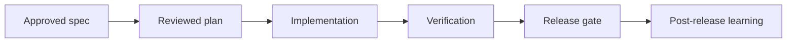

# {feature-name} Implementation Plan

> **For agentic workers:** REQUIRED SUB-SKILL: use `supervibe:writing-plans` before approval and `supervibe:executing-plans` after approval. Use `supervibe:subagent-driven-development` only when the user explicitly approved subagent execution.

**Goal:** State the measurable user or operator outcome, the owner, and the success metric in one sentence.

**Architecture:** Describe the runtime boundary, affected modules, data ownership, dependency direction, and the chosen tradeoff. Include the main rejected architecture if it changes coupling, risk, or rollback.

**Tech Stack:** List the exact languages, frameworks, package managers, storage layers, APIs, test tools, and runtime versions that constrain implementation.

**Constraints:** List hard rules for safety, privacy, compatibility, migration, support, cost, latency, release timing, and repository ownership.

---

## AI/Data Boundary

| Area | Allowed | Redaction | Approval gate |
|------|---------|-----------|---------------|
| Local source reads | yes | secrets, tokens, private payloads, user-owned local-only files | none for repository files |
| Local writes | yes | generated artifacts that must not ship | before commit through diff review |
| MCP/browser automation | yes/no with named tools | selectors, private page regions, cookies, screenshots | explicit approval before private data capture |
| Figma/design source | yes/no with file and node ids | hidden layers, paid assets, unreleased brand assets | explicit writeback approval |
| External network/API | yes/no with target domains | request bodies, response payloads, credentials | approval receipt for non-public targets |
| PII/secrets | references only unless approved | fields, logs, fixtures, screenshots, env values | named approver and receipt |

**Blocked without exact approval:** production mutation, destructive migration, credential changes, billing/account/DNS/access-control changes, Figma writeback, and screenshots containing private data.

---

## Retrieval, CodeGraph, And Visual Evidence

### Retrieval contract
- Project memory entries read: record query, result count, and top relevant ids.
- Code RAG queries: record exact queries, cited files, and why each source matters.
- Top source citations: list path and line or section for every claim that drives implementation.
- Freshness / stale-fact checks: state what can change, how it was verified, and what remains an assumption.

### CodeGraph contract
- Graph mode: N/A / callers / callees / neighbors / impact.
- Required commands:
  ```bash
  node scripts/search-code.mjs --context "{task-or-symbol}" --limit 10
  node scripts/search-code.mjs --callers "{symbol}"
  node scripts/search-code.mjs --impact "{symbol}" --depth 2
  ```
- Expected evidence: Case A callers found / Case B zero callers / Case C graph N/A with reason.
- Resolution caveat: report source coverage, symbol coverage, edge resolution, and any warnings.

### Visual explanation contract
- Required diagram: Mermaid flowchart / sequence / stateDiagram-v2 / C4-style context / table-only.
- Audience: beginner / engineer / operator.
- Accessibility: include `accTitle`, `accDescr`, and a text fallback for the same information.



Text fallback: approved requirements become a reviewed plan, implementation follows the critical path, verification gates release, and post-release learning updates future planning.

---

## Development Contract Map

| ID | Contract | Required details | Owner | Verification |
|----|----------|------------------|-------|--------------|
| C-BEH | Behavior contract | User-visible flows, edge cases, invariants, acceptance criteria | {owner} | Unit, integration, e2e, or smoke command |
| C-ARCH | Architecture contract | Module boundary, dependency direction, durable state, rejected alternatives | {owner} | Code review plus architecture check |
| C-DATA | Data and schema contract | Canonical types, migrations, validation, compatibility, fixtures | {owner} | Schema, migration, and contract tests |
| C-API | API and event contract | Endpoints, events, auth, idempotency, retries, error envelope, versioning | {owner} | API contract and consumer tests |
| C-UI | UI state contract | Loading, empty, error, permission, offline, optimistic, responsive states | {owner} | Component, accessibility, and visual checks |
| C-SEC | Security and privacy contract | Data classification, permissions, secrets, redaction, audit logs, abuse cases | {owner} | Threat review and security tests |
| C-PERF | Performance contract | SLOs, load shape, budgets, regression thresholds, profiling commands | {owner} | Benchmark or profiling command |
| C-OBS | Observability contract | Logs, metrics, traces, alerts, dashboards, correlation ids, runbook owner | {owner} | Dashboard or log assertion |
| C-ROLL | Rollout and rollback contract | Feature flag, staged rollout, migration rollback, restore path, kill switch | {owner} | Rollback drill or documented restore path |
| C-DOC | Documentation and support contract | Docs, changelog, migration notes, runbook, support handoff | {owner} | Documentation review |

---

## File Structure

### Created
```text
src/path/new-file.ext
tests/path/new-file.test.ext
docs/path/new-doc.md
```

### Modified
- `path/to/file.ext` - concrete behavioral, schema, API, UI, or validation change.

---

## Critical Path

`T1 -> T3 -> T5 -> T8 -> T-FINAL` (sequential)

Off-path: T2 || T4; T6 || T7

---

## Scope Safety Gate

- **Approved scope baseline:** list only items implemented by this plan and bind each to requirement ids.
- **Deferred scope:** valuable but not required now; include validation trigger and owner.
- **Rejected scope:** harmful or unnecessary now; include rationale, complexity cost, and tradeoff.
- **Scope expansion rule:** any new functionality requires an explicit scope-change note with user outcome, evidence, complexity cost, tradeoff, owner, verification, rollout, and rollback.
- **Execution stop condition:** if a task introduces functionality not mapped to the approved scope baseline, stop and re-plan instead of silently building it.

---

## Delivery Strategy

- **SDLC flow:** discovery -> spec -> plan -> review -> implementation -> verification -> release -> post-release learning.
- **MVP path:** smallest production-safe slice, internal or beta rollout, production rollout, and cleanup.
- **Phase model:** foundation, feature, hardening, release, operations, learning.
- **Launch model:** feature flag / cohort / staged rollout / one-shot migration with owner and stop criteria.
- **Production target:** support, observability, rollback, documentation, ownership, and handoff.

---

## Production Readiness

- **Test:** unit, integration, e2e, smoke, contract, migration, fixture, and regression coverage by risk.
- **Security/privacy:** threat model, permissions, data handling, secret boundaries, redaction, audit logging.
- **Performance:** SLOs, load shape, budget, profiling command, regression threshold.
- **Observability:** logs, metrics, traces, alerts, dashboards, correlation ids, runbook owner.
- **Rollback:** feature flag, migration rollback, restore path, kill switch, owner, decision threshold.
- **Release:** docs, changelog, migration notes, runbook, support handoff, stakeholder notification.

---

## Final 10/10 Acceptance Gate

- [ ] 10/10 acceptance: every requirement is implemented and verified.
- [ ] Verification: all task, phase, and release commands pass with captured output.
- [ ] No open blockers: unresolved risks are either closed or explicitly accepted by the user.
- [ ] Contract coverage: every Development Contract Map row touched by the work has a verification path.
- [ ] Production readiness: security, performance, observability, rollback, docs, and support gates pass.
- [ ] Plan reread: compare final implementation against this plan and fix deviations before handoff.

---

## Task T1: {component-or-contract}

**Files:**
- Create: `path/file.ext`
- Modify: `path/existing.ext`
- Test: `tests/path/test.ext`

**Scope IDs:** S1
**Requirement IDs:** REQ1
**Contract rows touched:** C-BEH, C-DATA, C-API, C-SEC, C-OBS, C-ROLL
**Estimated time:** 15min (confidence: high)
**Rollback:** revert the final commit or restore the listed files before commit.
**Risks:** R1: concrete risk; mitigation: concrete control, test, or approval gate.
**Stop conditions:** stop if scope expands, secrets are required, production mutation is requested, or verification cannot be run.

**Acceptance Criteria:**
- Requirement REQ1 is implemented through the listed files and verified by the listed commands.
- Contract rows C-BEH, C-DATA, C-API, C-SEC, C-OBS, and C-ROLL have explicit evidence.
- Rollback and support paths are documented before release.

- [ ] **Step 1: Write failing test**
```bash
node --test tests/path/test.ext
```
Expected output: command fails for the missing behavior, contract, or schema.

- [ ] **Step 2: Run test, verify fail**
```bash
node --test tests/path/test.ext
```
Expected output: failure is caused by the intended missing behavior, not environment setup.

- [ ] **Step 3: Minimal implementation**
- Update only the listed files and keep unrelated changes untouched.

- [ ] **Step 4: Run test, verify pass**
```bash
node --test tests/path/test.ext
```
Expected output: command exits 0 and covers the acceptance criteria.

- [ ] **Step 5: Run contract and release checks**
```bash
npm run check
```
Expected output: command exits 0 before version bump, commit, or release.

- [ ] **Step 6: Commit or no-commit handoff**
- Commit only after final verification passes, or state why commit is intentionally suppressed.

---

## REVIEW GATE 1 (after Phase A)

Before Phase B:
- [ ] All Phase A tasks complete with command evidence.
- [ ] No regressions in affected contracts.
- [ ] Scope safety reread completed.
- [ ] User approval or documented no-approval-required rationale exists.

---

## Self-Review

### Spec coverage
| Requirement | Task | Contract rows | Verification |
|-------------|------|---------------|--------------|
| REQ1 | T1 | C-BEH, C-DATA, C-API | `node --test tests/path/test.ext` |

### Contract coverage
| Contract row | Covered by task | Evidence |
|--------------|-----------------|----------|
| C-BEH | T1 | test command output |
| C-ROLL | T1 | rollback note and owner |

### Placeholder scan
- No unresolved template-token wording remains in the filled plan.

### Type consistency
- All named types, schema fields, event names, and API fields match implementation and tests.

### Dependency consistency
- Dependency direction matches the architecture contract and CodeGraph evidence.

---

## Execution Handoff

**Subagent-Driven batches:** list approved subagent batches, assigned files, and receipt ids.

**Inline batches:** list tasks executed inline, verification commands, blocked items, and release owner.
