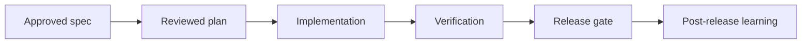

# <Feature> Implementation Plan

> **For agentic workers:** REQUIRED SUB-SKILL: Use supervibe:subagent-driven-development (recommended) or supervibe:executing-plans.

**Goal:** <one sentence>

**Architecture:** <2-3 sentences>

**Tech Stack:** <key libraries>

**Constraints:** <hard rules>

---

## AI/Data Boundary

| Area | Allowed | Redaction | Approval gate |
|------|---------|-----------|---------------|
| Local source reads | yes/no | <paths/fields> | <when> |
| Local writes | yes/no | <paths> | <when> |
| MCP/browser automation | yes/no/tools | <selectors/regions> | <when> |
| Figma/design source | yes/no/file/node | <hidden layers/assets> | <writeback approval> |
| External network/API | yes/no/targets | <request/response fields> | <approval receipt> |
| PII/secrets | references only/no access | <fields> | <approver> |

**Blocked without exact approval:** production mutation, destructive migration,
credential changes, billing/account/DNS/access-control changes, Figma writeback,
and screenshots containing private data.

---

## Retrieval, CodeGraph, And Visual Evidence

### Retrieval contract
- Project memory entries read:
- Code RAG queries:
- Top source citations:
- Freshness / stale-fact checks:

### CodeGraph contract
- Graph mode: N/A / callers / callees / neighbors / impact
- Required commands:
  ```bash
  node scripts/search-code.mjs --context "<task or symbol>" --limit 10
  node scripts/search-code.mjs --callers "<symbol>"
  node scripts/search-code.mjs --impact "<symbol>" --depth 2
  ```
- Expected evidence: Case A callers found / Case B zero callers / Case C graph N/A.
- Resolution caveat: report source coverage, symbol coverage, edge resolution, and any warnings.

### Visual explanation contract
- Required diagram: Mermaid flowchart / sequence / stateDiagram-v2 / C4-style context / table-only.
- Audience: beginner / engineer / operator.
- Accessibility: include `accTitle`, `accDescr`, and a text fallback for the same information.



---

## File Structure

### Created
```
<directory tree of new files>
```

### Modified
- `path/to/file.ext` - <what changes>

---

## Critical Path

`T1 -> T3 -> T5 -> T8 -> T-FINAL` (sequential)

Off-path: T2 || T4; T6 || T7

---

## Scope Safety Gate

- **Approved scope baseline:** <items implemented by this plan>.
- **Deferred scope:** <valuable but not required now; include validation trigger>.
- **Rejected scope:** <harmful or unnecessary now; include rationale>.
- **Scope expansion rule:** any new functionality requires an explicit scope-change note with user outcome, evidence, complexity cost, tradeoff, owner, verification, rollout, and rollback.
- **Execution stop condition:** if a task introduces functionality not mapped to the approved scope baseline, stop and re-plan instead of silently building it.

---

## Delivery Strategy

- **SDLC flow:** discovery -> spec -> plan -> review -> implementation -> verification -> release -> post-release learning.
- **MVP path:** <smallest production-safe slice, beta/internal rollout, production rollout>.
- **Phase model:** <foundation, feature, hardening, release, operations>.
- **Launch model:** <feature flag / cohort / staged rollout / one-shot migration>.
- **Production target:** <support, observability, rollback, documentation, ownership>.

---

## Production Readiness

- **Test:** <unit / integration / e2e / smoke / contract coverage>.
- **Security/privacy:** <threat model, permissions, data handling, secret boundaries>.
- **Performance:** <SLOs, load shape, budget, regression threshold>.
- **Observability:** <logs, metrics, traces, alerts, dashboards>.
- **Rollback:** <feature flag, migration rollback, restore path, owner>.
- **Release:** <docs, changelog, migration notes, runbook, support handoff>.

---

## Final 10/10 Acceptance Gate

- [ ] 10/10 acceptance: every requirement is implemented and verified.
- [ ] Verification: all task, phase, and release commands pass with captured output.
- [ ] No open blockers: unresolved risks are either closed or explicitly accepted by the user.
- [ ] Production readiness: security, performance, observability, rollback, docs, and support gates pass.
- [ ] Plan reread: compare final implementation against this plan and fix deviations before handoff.

---

## Task N: <Component>

**Files:**
- Create: `path/file.ext`
- Modify: `path/existing.ext:NN-MM`
- Test: `tests/path/test.mjs`

**Estimated time:** 15min (confidence: high)
**Rollback:** `git revert <sha>`
**Risks:** R1: <desc>; mitigation: <how>

- [ ] **Step 1: Write failing test**
```javascript
// test code
```

- [ ] **Step 2: Run test, verify fail**

- [ ] **Step 3: Minimal impl**

- [ ] **Step 4: Run test, verify pass**

- [ ] **Step 5: Commit**

---

## REVIEW GATE 1 (after Phase A)

Before Phase B:
- [ ] All Phase A committed and tests green
- [ ] No regressions
- [ ] User approved

---

## Self-Review

### Spec coverage
| Requirement | Task |

### Placeholder scan
- No TBD found

### Type consistency
- All types match

---

## Execution Handoff

**Subagent-Driven batches:** ...
**Inline batches:** ...

Which approach?
