# Billing Export MVP Implementation Plan

This is a filled canonical plan example. Keep the structure, but replace the domain values with real evidence from the current repository. A valid plan does not contain unresolved template tokens, generic paths, generic owners, or unverified claims.

> **For agentic workers:** REQUIRED SUB-SKILL: use `supervibe:writing-plans` before approval and `supervibe:executing-plans` after approval. Use `supervibe:subagent-driven-development` only when the user explicitly approved worker execution and write sets are disjoint.

**Goal:** Operators can export the last 90 days of billing events as a CSV from the admin billing screen, with a successful export created in under 30 seconds for accounts with up to 25,000 events.

**Owner:** Billing platform owner.

**Architecture:** Add one backend export service behind the existing authenticated admin API and one UI action in the billing dashboard. Billing event storage remains owned by the billing module. The export service reads through the existing billing repository, streams normalized rows, records an audit log entry, and returns a signed short-lived download URL. The rejected approach is a client-side export because it would duplicate billing rules in the browser, expose raw event fields, and make rollback harder.

**Tech Stack:** Node.js 22.5+, npm, `node:test`, existing admin API routing, existing billing repository, CSV serialization in a local helper, existing audit logging, existing frontend component test stack, and `npm run check` as release gate.

**Constraints:** No production mutation during implementation. No new database table unless the PRD explicitly adds async export jobs. No raw payment identifiers in CSV, logs, screenshots, fixtures, or error output. Export scope is 90 days. Existing permissions decide access. The MVP must be reversible by disabling the UI action and reverting the final commit.

---

## AI/Data Boundary

| Area | Allowed | Redaction | Approval gate |
|------|---------|-----------|---------------|
| Local source reads | repository files, tests, package scripts, generated registry | secrets, tokens, private local notes | none for tracked repository files |
| Local writes | plan, tests, billing export implementation, docs, changelog | generated artifacts that must not ship | diff review before commit |
| Browser automation | local admin screen only when needed for UI smoke | cookies, private payloads, private screenshots | user approval before private data capture |
| Design source | not used for this MVP | unreleased brand assets | explicit writeback approval if later needed |
| External network/API | public documentation only for best-practice checks | request bodies, credentials, private responses | approval receipt for non-public targets |
| PII/secrets | references to field classes only | customer names, emails, payment tokens, invoice ids in fixtures | named approver and receipt before using real data |

**Blocked without exact approval:** production mutation, destructive migration, credential changes, billing/account/DNS/access-control changes, Figma writeback, and screenshots containing private data.

---

## Retrieval, CodeGraph, And Visual Evidence

### Retrieval contract
- Project memory entries read: query `billing export admin csv`, result count, and top relevant ids.
- Code RAG queries: `billing repository export`, `admin billing routes`, `audit logging helper`, `download URL signing`; cite each source path and why it matters.
- Top source citations: record path and line or section for every implementation claim, especially permission checks, billing data shape, and audit logging behavior.
- Freshness checks: verify package scripts and current route names from local files before finalizing tasks.

### CodeGraph contract
- Graph mode: callers and impact for the billing repository, admin billing route, and audit logger.
- Required commands are the source search, caller, and impact checks below.
  ```bash
  node scripts/search-code.mjs --context "billing export admin route" --limit 10
  node scripts/search-code.mjs --callers "billingRepository.listEvents"
  node scripts/search-code.mjs --impact "auditLog.record" --depth 2
  ```
- Expected evidence: Case A callers found for reused helpers, Case B zero callers only for newly created helper, or Case C graph not available with a concrete reason.
- Resolution caveat: report source coverage, symbol coverage, edge resolution, and any warnings before claiming 10/10 readiness.

### Visual explanation contract
- Visual mode: browser-first visual packet with local preview path `.supervibe/artifacts/visual-explanations/billing-export-mvp-plan/index.html`.
- Audience: engineer and operator.
- Accessibility: include a text fallback for the same information; if Mermaid fallback/export is emitted, include `accTitle` and `accDescr`.

| Card | Meaning | Evidence | Stop condition |
|------|---------|----------|----------------|
| Approved requirements | Billing PRD and scope gate are the input | PRD and memory/RAG/CodeGraph evidence | approval missing |
| Failing tests | Contract tests define behavior first | node test output | tests do not fail for the expected reason |
| Implementation | Service, route, client, and UI are built | source citations | unapproved scope appears |
| Release gate | Verification, rollback, docs, and support are complete | `npm run check` and release note | open blocker remains |

```mermaid
flowchart LR
  %% accTitle: Billing export MVP implementation flow
  %% accDescr: The plan starts from approved billing requirements, verifies repository and permission boundaries, adds tests and implementation, then releases behind a reversible admin UI action.
  PRD[Approved billing PRD] --> Evidence[Memory RAG CodeGraph evidence]
  Evidence --> Tests[Failing contract and UI tests]
  Tests --> Service[Export service and admin route]
  Service --> UI[Billing dashboard action]
  UI --> Verify[Security performance observability rollback checks]
  Verify --> Release[Version commit push]
```



Text fallback: approved billing requirements drive evidence collection, evidence drives tests, tests drive backend and UI implementation, and release waits for security, performance, observability, rollback, and documentation checks. The browser-first preview is the primary visual; Mermaid is fallback/export only.

---

## Development Contract Map

| ID | Contract | Required details | Owner | Verification |
|----|----------|------------------|-------|--------------|
| C-BEH | Behavior contract | Admin can request CSV export, receives expected columns, and sees actionable errors for empty range, forbidden access, timeout, and degraded signing | Billing platform owner | `node --test tests/billing/export-service.test.mjs tests/admin/billing-export-route.test.mjs` |
| C-ARCH | Architecture contract | Export service depends on billing repository and audit logger; UI depends on admin API client only; no reverse dependency from billing storage to UI | Billing platform owner | CodeGraph impact output plus code review |
| C-DATA | Data and schema contract | Canonical CSV columns are `event_time`, `event_type`, `amount_cents`, `currency`, `invoice_reference`, `account_reference`; raw payment identifiers are excluded | Billing platform owner | CSV fixture snapshot and redaction test |
| C-API | API and event contract | `POST /admin/billing/export` accepts date range and returns signed URL, row count, expiry, and correlation id with stable error envelope | API owner | API route test and typed client test |
| C-UI | UI state contract | Button, loading, disabled, empty, success, error, permission, and retry states are represented without layout shift | Frontend owner | Component test and local smoke check |
| C-SEC | Security and privacy contract | Admin permission required, PII excluded, audit log written, secrets never logged, signed URL expires in 10 minutes | Security owner | Permission, redaction, and audit assertions |
| C-PERF | Performance contract | 25,000 events exported under 30 seconds with streaming and bounded memory | Billing platform owner | Performance fixture or profiling command |
| C-OBS | Observability contract | Correlation id, export duration, row count, result status, and error code logged without sensitive fields | Operations owner | Log assertion or local structured log check |
| C-ROLL | Rollout and rollback contract | UI action can be disabled by config, route can be reverted, no migration required, support can instruct manual invoice download | Release owner | Rollback note and config smoke check |
| C-DOC | Documentation and support contract | Admin docs, changelog entry, support note, and known limits describe export range, permissions, and redaction | Support owner | Documentation review |

---

## File Structure

### Created
```text
src/billing/export-service.mjs
src/admin/billing-export-route.mjs
src/admin/billing-export-client.mjs
tests/billing/export-service.test.mjs
tests/admin/billing-export-route.test.mjs
tests/admin/billing-export-client.test.mjs
docs/admin/billing-export.md
```

### Modified
- `src/admin/billing-dashboard.mjs` - adds the export action and UI states.
- `src/billing/billing-repository.mjs` - exposes a read-only date-range iterator if no suitable method exists.
- `src/audit/audit-log.mjs` - reuses existing audit event shape for billing export.
- `CHANGELOG.md` - records the MVP export capability and rollback note.

---

## Critical Path

`T1 -> T2 -> T3 -> T4 -> T-FINAL` is sequential.

Off-path tasks that can run only after T1 evidence is captured: documentation and support copy.

Parallel work is allowed only when write sets are disjoint. Backend route and frontend client cannot be implemented in parallel until the API contract from T1 is fixed.

---

## Scope Safety Gate

- **Approved scope baseline:** S1 CSV export for admin billing events, S2 permission check, S3 signed short-lived download URL, S4 audit log, S5 UI states, S6 docs and support note.
- **Deferred scope:** scheduled recurring exports, async job queue, email delivery, multi-format export, full invoice PDF export, dashboard analytics, localization, and self-serve customer portal export.
- **Rejected scope:** client-side export from raw table data because it duplicates billing rules, increases privacy risk, and weakens rollback.
- **Scope expansion rule:** any new functionality requires a scope-change note with user outcome, evidence, complexity cost, tradeoff, owner, verification, rollout, and rollback.
- **Execution stop condition:** if a task introduces functionality not mapped to S1-S6, stop and re-plan instead of silently building it.

---

## Delivery Strategy

- **MVP production slice:** a single admin-triggered CSV export that is deployable, tested, observable, reversible, documented, and supportable.
- **User value:** billing operators can answer account-level billing questions without asking engineering for ad hoc database extracts.
- **No extra features / anti-bloat:** optional formats, scheduling, queues, and analytics stay deferred until export usage and support load justify them.
- **Delivery discipline:** discovery evidence -> PRD -> reviewed plan -> tests -> implementation -> verification -> release -> post-release learning.
- **Phase model:** evidence, contract, backend, frontend, hardening, release, learning.
- **Launch model:** one-shot release behind admin permission and optional config disablement. Stop if permission checks, redaction tests, or rollback evidence fail.
- **Production target:** support, observability, rollback, documentation, ownership, and handoff are complete before push.

---

## Production Readiness

- **Test:** unit, integration, component, smoke, contract, fixture, permission, redaction, and regression coverage mapped to contract rows.
- **Security/privacy:** threat review covers permission bypass, URL leakage, raw payment identifier exposure, audit log content, and fixture safety.
- **Performance:** fixture with 25,000 events proves memory and duration budget or records a concrete risk accepted by the user.
- **Observability:** logs include correlation id, duration, row count, result, and error code; metrics or structured log assertions are captured.
- **Rollback:** disable UI config, revert route registration, and restore changed files before commit if verification fails. No migration means data rollback is not required.
- **Release:** docs, changelog, support note, stakeholder notification, and final `npm run check` output are captured.

---

## Final 10/10 Acceptance Gate

- [ ] 10/10 acceptance: every requirement is implemented and verified.
- [ ] Verification: all task, phase, and release commands pass with captured output.
- [ ] No open blockers: unresolved risks are closed or explicitly accepted by the user.
- [ ] Contract coverage: every touched Development Contract Map row has evidence.
- [ ] Production readiness: security, performance, observability, rollback, docs, and support gates pass.
- [ ] Deploy-only remaining: after this plan, no code, test, review, or documentation work remains before package deployment.
- [ ] Plan reread: compare final implementation against this plan and fix deviations before handoff.

---

## Task T1: Lock Billing Export Contract And Failing Tests

**Files:**
- Create: `tests/billing/export-service.test.mjs`
- Create: `tests/admin/billing-export-route.test.mjs`
- Create: `tests/admin/billing-export-client.test.mjs`
- Modify: `docs/admin/billing-export.md`

**Scope IDs:** S1, S2, S3, S4, S5, S6
**Requirement IDs:** REQ-BILL-EXPORT-001, REQ-BILL-EXPORT-002, REQ-BILL-EXPORT-003
**Contract rows touched:** C-BEH, C-DATA, C-API, C-UI, C-SEC, C-OBS, C-ROLL, C-DOC
**Estimated time:** 45min, confidence high after CodeGraph confirms current route and repository names.
**Rollback:** delete the created test files and docs draft before implementation commit.
**Risks:** R1: tests encode a contract that conflicts with existing billing naming; mitigation: cite current repository fields from RAG and CodeGraph before writing assertions.
**Stop conditions:** stop if no existing admin permission primitive is found, if export requires new persistent jobs, if secrets are required, or if verification cannot run.

**Acceptance Criteria:**
- REQ-BILL-EXPORT-001 maps to a failing export service test for column order, date range, redaction, empty result, and 25,000-row fixture.
- REQ-BILL-EXPORT-002 maps to a failing route test for permission, request validation, signed URL expiry, audit event, and stable error envelope.
- REQ-BILL-EXPORT-003 maps to a failing client or component test for loading, success, empty, error, retry, and forbidden states.
- Contract rows C-BEH, C-DATA, C-API, C-UI, C-SEC, C-OBS, C-ROLL, and C-DOC have explicit test or documentation evidence.

- [ ] **Step 1: Write failing tests**
```bash
node --test tests/billing/export-service.test.mjs tests/admin/billing-export-route.test.mjs tests/admin/billing-export-client.test.mjs
```
Expected output: command fails because export service, route, or client behavior is not implemented.

- [ ] **Step 2: Verify the failure is meaningful**
```bash
node --test tests/billing/export-service.test.mjs tests/admin/billing-export-route.test.mjs tests/admin/billing-export-client.test.mjs
```
Expected output: failures point to missing behavior, not syntax errors, missing fixtures, or environment setup.

- [ ] **Step 3: Contract self-review before implementation**
- Confirm every assertion maps to S1-S6 and REQ-BILL-EXPORT-001 through REQ-BILL-EXPORT-003.
- Confirm no test fixture contains customer email, payment token, private invoice id, or secret.
- Confirm docs name rollback and support path before implementation begins.

---

## Task T2: Implement Backend Export Service And Route

**Files:**
- Create: `src/billing/export-service.mjs`
- Create: `src/admin/billing-export-route.mjs`
- Modify: `src/billing/billing-repository.mjs`
- Modify: `src/audit/audit-log.mjs`
- Test: `tests/billing/export-service.test.mjs`
- Test: `tests/admin/billing-export-route.test.mjs`

**Scope IDs:** S1, S2, S3, S4
**Requirement IDs:** REQ-BILL-EXPORT-001, REQ-BILL-EXPORT-002
**Contract rows touched:** C-BEH, C-ARCH, C-DATA, C-API, C-SEC, C-PERF, C-OBS, C-ROLL
**Estimated time:** 90min, confidence medium because route registration details must be verified locally.
**Rollback:** remove the route registration, remove `src/billing/export-service.mjs`, restore repository and audit helper changes, and rerun targeted tests.
**Risks:** R2: export creates memory pressure; mitigation: stream rows or process bounded batches and run the 25,000-row fixture. R3: audit log leaks sensitive data; mitigation: assert redacted structured payload.
**Stop conditions:** stop if implementation needs a database migration, a queue, a new secrets provider, or a permissions redesign not approved in this MVP.

**Acceptance Criteria:**
- Export service returns the approved CSV columns in stable order.
- Route validates date range, checks admin permission, writes audit log, returns signed URL, and uses stable error envelope.
- Redaction, permission, performance fixture, and observability assertions pass.

- [ ] **Step 1: Minimal implementation**
- Implement only the listed files and keep unrelated billing behavior untouched.

- [ ] **Step 2: Run targeted backend tests**
```bash
node --test tests/billing/export-service.test.mjs tests/admin/billing-export-route.test.mjs
```
Expected output: command exits 0 and covers behavior, data, API, security, performance, observability, and rollback criteria.

- [ ] **Step 3: Run dependency impact check**
```bash
node scripts/search-code.mjs --impact "billing export" --depth 2
```
Expected output: output cites impacted modules or records graph limitation without hiding it.

---

## Task T3: Implement Admin UI Action And Client States

**Files:**
- Create: `src/admin/billing-export-client.mjs`
- Modify: `src/admin/billing-dashboard.mjs`
- Test: `tests/admin/billing-export-client.test.mjs`

**Scope IDs:** S3, S5
**Requirement IDs:** REQ-BILL-EXPORT-003
**Contract rows touched:** C-BEH, C-API, C-UI, C-SEC, C-OBS, C-ROLL
**Estimated time:** 60min, confidence medium because existing frontend test harness must be confirmed.
**Rollback:** remove the UI action and typed client, restore the dashboard file, and keep backend route disabled if UI verification fails.
**Risks:** R4: UI permits unauthorized users to discover export action; mitigation: permission-driven rendering and forbidden-state test.
**Stop conditions:** stop if UI state coverage requires a broader dashboard rewrite or new design-system work outside the MVP.

**Acceptance Criteria:**
- Export action renders only for permitted admins.
- Loading, disabled, empty, success, error, retry, and forbidden states are tested.
- Signed URL result is handled without logging sensitive data.

- [ ] **Step 1: Implement typed client and UI state changes**
- Keep the dashboard layout stable and avoid unrelated visual refactors.

- [ ] **Step 2: Run targeted UI/client tests**
```bash
node --test tests/admin/billing-export-client.test.mjs
```
Expected output: command exits 0 and covers all UI states.

---

## Task T4: Release Readiness, Documentation, Version, Commit, Push

**Files:**
- Modify: `docs/admin/billing-export.md`
- Modify: `CHANGELOG.md`
- Modify: `package.json`
- Modify: `package-lock.json`

**Scope IDs:** S6
**Requirement IDs:** REQ-BILL-EXPORT-004
**Contract rows touched:** C-DOC, C-OBS, C-ROLL
**Estimated time:** 45min, confidence high after T1-T3 pass.
**Rollback:** restore version files and changelog before commit if release gate fails; after commit, revert the final commit.
**Risks:** R5: release notes overclaim unsupported behavior; mitigation: docs must cite exact limits, support path, and rollback.
**Stop conditions:** stop if `npm run check` fails for changes caused by this plan, if old blockers remain open, or if version surfaces disagree.

**Acceptance Criteria:**
- Documentation explains range limit, permissions, redacted fields, support path, known limits, and rollback.
- Version files are synchronized.
- Final verification passes.
- Commit contains only scoped changes and is pushed to the intended branch.

- [ ] **Step 1: Run full release check**
```bash
npm run check
```
Expected output: command exits 0 before commit or push.

- [ ] **Step 2: Run final old-token and placeholder scan**
```bash
node scripts/validate-template-quality.mjs
```
Expected output: command exits 0 and reports no unresolved template placeholders.

- [ ] **Step 3: Commit and push**
```bash
git status --short
git add src tests docs CHANGELOG.md package.json package-lock.json
git commit -m "Add billing export MVP"
git push origin main
```
Expected output: commit succeeds and push updates `main`.

---

## REVIEW GATE 1 After Contract Lock

Before T2:
- [ ] T1 tests fail for the intended missing behavior.
- [ ] Scope safety reread confirms S1-S6 only.
- [ ] API contract, data contract, permission contract, observability contract, and rollback contract have explicit evidence.
- [ ] User approval or documented no-approval-required rationale exists.

---

## REVIEW GATE 2 Before Release

Before T4:
- [ ] T1-T3 targeted commands pass.
- [ ] No regressions in affected contracts.
- [ ] Security/privacy assertions pass and fixtures are redacted.
- [ ] Rollback path is executable without data migration.
- [ ] No open blockers remain.

---

## Self-Review

### Spec coverage
| Requirement | Task | Contract rows | Verification |
|-------------|------|---------------|--------------|
| REQ-BILL-EXPORT-001 | T1, T2 | C-BEH, C-DATA, C-PERF | `node --test tests/billing/export-service.test.mjs` |
| REQ-BILL-EXPORT-002 | T1, T2 | C-API, C-SEC, C-OBS, C-ROLL | `node --test tests/admin/billing-export-route.test.mjs` |
| REQ-BILL-EXPORT-003 | T1, T3 | C-UI, C-API, C-SEC | `node --test tests/admin/billing-export-client.test.mjs` |
| REQ-BILL-EXPORT-004 | T4 | C-DOC, C-OBS, C-ROLL | `npm run check` |

### Contract coverage
| Contract row | Covered by task | Evidence |
|--------------|-----------------|----------|
| C-BEH | T1, T2, T3 | service, route, and client tests |
| C-ARCH | T2 | CodeGraph impact output and review |
| C-DATA | T1, T2 | CSV fixture and redaction test |
| C-API | T1, T2, T3 | route and typed client tests |
| C-UI | T1, T3 | UI state tests |
| C-SEC | T1, T2, T3 | permission, redaction, audit assertions |
| C-PERF | T2 | 25,000-row fixture or accepted risk |
| C-OBS | T2, T4 | structured log assertion and docs |
| C-ROLL | T1, T2, T3, T4 | rollback notes and disable path |
| C-DOC | T1, T4 | admin docs and changelog |

### Placeholder scan
- The final plan must contain no unresolved brace tokens, angle tokens, generic file paths, generic owners, empty evidence fields, or acceptance criteria without commands.

### Type consistency
- CSV columns, request fields, response fields, error codes, and audit event names match implementation and tests.

### Dependency consistency
- Dependency direction matches the architecture contract and CodeGraph evidence.

### Scope consistency
- Every implemented behavior maps to S1-S6. Deferred and rejected scope remains outside the commit.

---

## Execution Handoff

**Approved worker batches:** none in this example because backend and frontend depend on the same API contract. Add worker batches only after disjoint write sets and receipts are available.

**Inline batches:** T1-T4 executed sequentially with targeted command evidence, final `npm run check`, release owner signoff, version update, commit, and push.

**Blocked items:** any failed permission, redaction, performance, observability, rollback, or full-check gate blocks release and requires plan repair before continuing.
