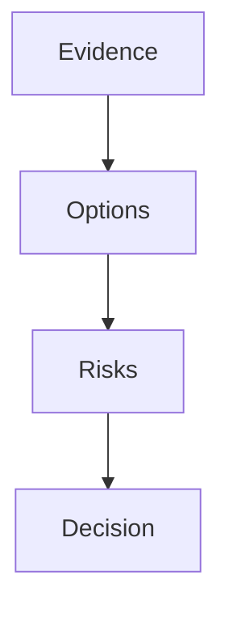

# Decision Brief: Agent Readiness Gates

## Executive Summary

- Plain-language outcome: The system is strong, but it must show proof before it can claim full readiness.
- Recommended action: Continue with readiness gate hardening.
- Confidence: 9/10 after validators and release checks pass.
- Main reason: Missing evidence should be visible instead of treated as success.

## User Decision

| Choice | When to choose it | Impact |
| --- | --- | --- |
| Continue | You accept the proposed gate hardening. | Adds validators and clearer status output. |
| Revise | You want fewer gates in this release. | Reduces scope before implementation. |
| Defer | You want to keep current behavior. | Existing no-op gaps remain visible as risk. |
| Stop | You do not want readiness work now. | No implementation starts. |

## Visual Explanation

Text fallback: verify evidence first, compare options and risks, then choose the next action.

## Options

| Option | Benefit | Cost | Risk | Recommendation |
| --- | --- | --- | --- | --- |
| Recommended | Blocks weak 10/10 claims. | Adds validators. | More release checks. | Continue. |
| Smaller scope | Faster release. | Some gaps remain. | Readiness is less defensible. | Use only if time is limited. |
| Defer | No code change. | No improvement. | Missing evidence remains. | Avoid unless release is blocked. |

## Risk And Tradeoff Summary

- Highest risk: The system can look green because no artifacts exist.
- Mitigation: Add strict readiness checks and golden fixtures.
- Scope tradeoff: Vendor-specific tracker work stays out of this release.
- Rollback path: Revert the release commit.

## Implementation Snapshot

- Architecture impact: Maturity reporting gains artifact readiness evidence.
- API contract impact: API contract template and validator are added.
- Frontend integration impact: API contracts require frontend states and mock scenarios.
- Data and privacy impact: No PII is required.
- Task tracker impact: Native-only status is explicit.

## Next User Actions

- [ ] Continue to the next gated phase.
- [ ] Revise the plan before implementation.
- [ ] Defer selected scope.
- [ ] Stop and archive the current artifact.

## Acceptance And Evidence

- 10/10 acceptance: Release checks pass and unresolved runtime telemetry gaps are explicit.
- Verification evidence: `npm run check` and maturity commands pass or report honest blockers.
- Source citations: scripts and tests changed in this release.
- Open blockers: Real host-agent telemetry cannot be fabricated.

